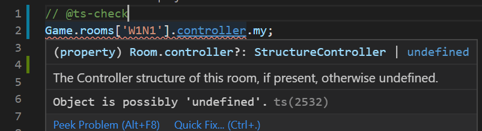
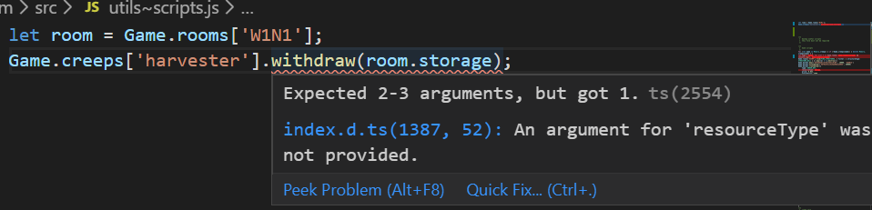
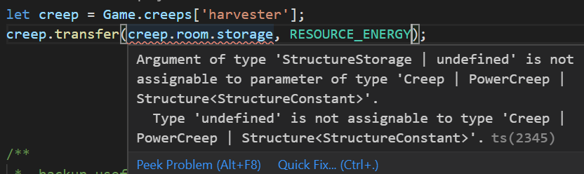
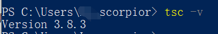
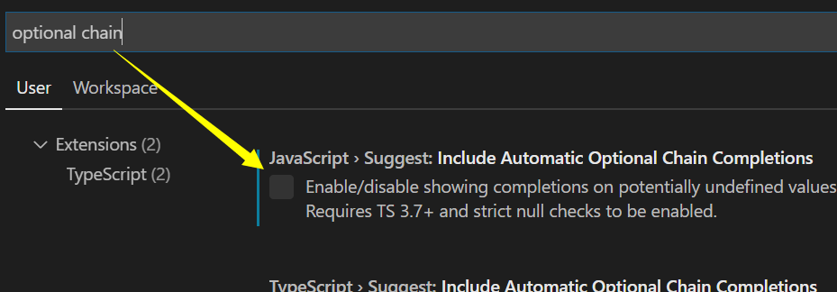
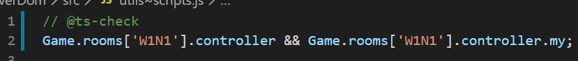
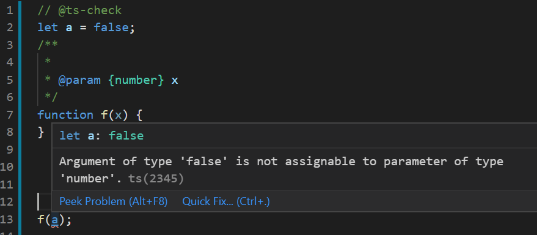

  
QQ群：565401831  
游戏介绍及入手请移步：[hoho大佬简书教程](https://www.jianshu.com/p/5431cb7f42d3)  
[系列目录](https://zhuanlan.zhihu.com/p/104412058)  
Version：1.1   
Author：Scorpior   

# VSCode+JavaScript 增强类型检查
在编程时获得近似 **TypeScript** 的类型检查，辅助你减少bug。

先看几个效果图。   

     

     

     

  

## 步骤1：配置 VSC+JS 开发环境 
[**hoho教程**](https://www.jianshu.com/p/5603d0c486b1)讲的很详细。

## 步骤2：安装 TypeScript
Windows 打开 cmd 或者 PowerShell，输入```npm install -g typescript```，成功后可以用```tsc -v```查看版本，需要 ts 版本为3.7以上。     
   

## 步骤3：关掉 VSC 设置
从 VSC 左下角打开设置，搜索 **optional chain**，确认 **JavaScript>Suggest: include Automatic Optional Chain Completions** 这条取消。这可以避免自动补出```?.```这一 TypeScript 语法。这个设置已经正常生效。   
   

### 可选操作
搜索 **suggest name**，确认 **JavaScript>Suggest: Names** 这条取消。这可以避免跨变量名声明范围的自动补全，也就是自动补全提示的一定是在光标位置有定义的变量（属性）。这个在下面开启类型检查后的 js 文件中会自动关闭，所以可做可不做。

## 步骤3：在项目文件中开启类型检查
在工作文件夹内新建 **jsconfig.json** 文件，里面写
```json
{
    "include": [
        "src/*"
    ],
    "compilerOptions": {
        "target": "es2016",
        "strict": true
    }
}
```
其中 **include** 数组中填你要检查的 js 文件地址，比如 "*" 代表和 jsconfig.json 文件相同目录的所有 .js 文件。可以增加 **exclude** 选项设置不想检查的文件。

### 方法1：逐文件开启
在 .js 文件顶部第一行注释```// @ts-check```即可开启单文件检查。 

效果1：检查 controller，如果 controller 可能不存在就对其操作会有**红色波浪线**提示如下图，   
   
如果判断过 controller 就能通过检查。   
   

效果2：检查参数类型，函数需要用```// @param```注释写上参数类型（VSC 中在函数上方空行输入```/**```后按回车会自动补全```@param```列表），函数未说明参数类型或者传入参数类型不符同样有红色波浪线提示。   
   

效果3：提示typo。    
  


其他效果就不举例了。在变量声明前用```// @type```可以声明变量类型，配合 .d.ts 文件声明自定义类型使用，效果更佳。（自定义类型写法可以参照安装的官方类型自动补全中的 index.d.ts 文件）   

用```// @ts-ignore```可以设置下一行代码不被检查。
###  方法2：全体文件开启
修改 **jsconfig.json** 文件，```compilerOptions```里面写```checkJs:true```。
```json
{
    "include": [
        "src/*"
    ],
    "compilerOptions": {
        "target": "es2016",
        "checkJs": true,
        "strict": true
    }
}
```
这样就对 include 指定的所有文件开启检查，效果与逐文件开启相同。   

在文件第一行写```// @ts-nocheck```可以设置本文件不被检查，或者也可以在 jsconfig.json 里写 exclude。