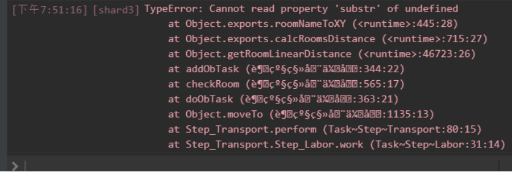
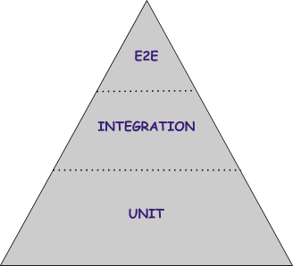

QQ群：565401831  
游戏介绍及入手请移步：[hoho大佬简书教程](https://www.jianshu.com/p/5431cb7f42d3)  
[系列目录](https://zhuanlan.zhihu.com/p/104412058)  
Version：1.0   
Author：Cookies, Scorpior

# 如何debug你的代码

许多人尤其是新手都在debug代码的时候遇到过许多问题。今天会从自己寻找bug，到如何减少甚至避免bug，给大家提供一些思路。当然这些并不限制于Screeps，在其他地方也可以用。

作为进阶教程，这里不介绍最基础的语法问题了，如果遇到了不能解决的语法问题，先检查一下标点符号2333。

**注意，这篇教程中所有的代码只是提供思路，并不保证正确。**

## 1. 如何定位bug

### 1.1  通过Stack Trace

满屏红字.jpg 

首先，每个报错的后面都会跟着一串

     

这一串是非常有用的数据。可以看到每个函数调用和行数。首先其中第一行是报错原因，简要描述了你是数据类型错误、是数组越界还是其他什么。第二行往后是报错代码所在的位置，左边`roomNameToXY`是函数名，右边括号里的信息是 **文件名：行号：这行第几个字符**，其中`<runtime>`代表是服务器代码，乱码是自己的中文文件名，然后`Task~Step~Transport`之类的就是正常显示的文件名了。报错文件中排列越靠上的就越接近报错位置，一般可以忽略其中代表服务器代码的信息，直接找自己写的文件中对应位置就好。

如果并没有报错，没有Stack Trace，但是想看到哪个函数调用了这个函数的话，可以手动打印：

```js
console.log(Error());
```

### 1.2 寻找错误根源

通过Stack Trace可以找到错误产生的整个路径。但是不一定能找到问题的根源。  
例如：
```js
creep.harvest(source); // TypeError: creep.harvest is not a function
```
你知道了在什么情况下 creep 这个对象没有 harvest 这个函数。但是你不知道为什么。  
这个时候第一步，先`console.log(creep)`，这样你可以知道creep是什么东西。  

例如我们看到的结果可能是 `undefined` 或者是 `[Room E1S1]`之类的。  
这个时候就要给每次creep这个值发生改变和进出函数的时候打印log（最好附上是哪个文件哪一行，这样方便找到是哪个改变出现了问题）。如此反复就可以找到问题的根源。

### 1.3 Logger

一个问题如果一直出现，虽然他对你影响很大，但是你很幸运，因为复现问题很容易，你可以一直在相同的情况下打印不同的东西，修改各种代码，直到问题被解决。  
但是有的bug很难出现。有一天上线你突然看到一个报错，但是其他时候就像没有这个问题一样。  

为了解决这种问题，我们需要一个logger。对于 Screeps 来说，我们最希望 logger 可以记录下来我们不在线的时候出现的问题，以及对debug可能有用的信息。

#### 如何实现 logger 

Logger主要是给人看的，游戏里的代码并没有必要去读，所以可以合理利用邮件系统。每个邮件可以发送1000个字符。每个tick可以发送最多20次。

```js
let message = ""

// 每个需要log的地方可以记录一下
function log(传入的信息) {
  const 调用的文件和行数 = `(${Error().stack.split("\n")[2]})`;
  const 时间 = `[${Game.time}]`;
  message += `${时间}${传入的信息}${调用的文件和行数}\n`;
}

// 每个tick结束的时候调用
function 发送() {
  //这里没有写，但是如果你的message可能很长，需要分割成1000字符的小段。
  Game.notify(message, 1440);
  message = "";
}
```
这样你每天会收到一封可能非常长的log邮件，可以慢慢分析。而且自动包括了时间和最基础的context。你也可以考虑把每天的log存在一个segment里面，这样在邮件到达之前也可以看到当天的log。

#### 如何  log

1. 重要函数的出入口  
   记录一下每次调用函数的地方传入的参数，记录一下函数的返回值，对debug非常有帮助。  
2. 新增/修改的功能  
   新增/修改的功能是最容易出现bug的地方。可以多增加一些log。对重要的变量（例如状态机的状态），复杂的函数进行一些log。等运行时间久了，bug解完了，功能稳定之后可以减少这种因为新增功能添加的log。  
3. 使用情况较少的功能  
   因为log的最大功能是找出难以复现的bug，对于使用情况较少的功能值得多进行log。因为使用的较少，即使很多log也不会产生太多的噪音。  
4. 大致定位的bug
   已经大致定位了bug，但是需要寻找根源的时候，可以用1.2的方法打印很多log，在任何可能出现问题的地方都打印log。解决问题之后可以通过[git revert](https://git-scm.com/docs/git-revert)删除增加的log。

## 2. 如何避免bug

避免bug比寻找bug还是轻松很多。下面和大家分享一些避免bug的方法。

### 2.1 IDE
如果你还在用Notepad++, Vim, 或者游戏自带编辑器。  
试试看用一些现代IDE。IDE可以帮你实现找出许多bug，自动补全可以避免手误打错。
这里推荐大家使用 Webstorm 或者 Visual Studio Code。

### 2.2 类型
JavaScript的很大一个问题是没有类型，虽然这个给你很大的自由度，但是也很容易出现bug。
加入类型可以避免很多bug，而且让自动补全更加方便。  
你可以选择用 *TypeScript* 这种有类型的语言来写Screeps，也可以用 ( Scorpior的教程 )[ JS类型补全.md ]

### 2.3 Lint
[ESLint](https://eslint.org/) 可以非常好用地避免一些简单的错误，例如
```js
if (a = b) {
  // ...
}

for (let i = 0; i < size; i--) {
  // ...
}

if ( a == NaN ) {
  // ...
}
```


### 2.4 测试
测试是软件非常重要的一部分。单元测试可以快速的在本地发现并且定位简单问题。集成测试可以在错误的代码造成破坏之前发现问题。

关于测试有很多书，很多详细的教程。这里更多给大家一些思路。如果需要更加系统的学习，大家可以去互联网上寻找。

JavaScript 有非常好用的测试框架。我个人比较喜欢用 [mocha](https://mochajs.org/) + [chai](https://www.chaijs.com/)。

只需要写好测试文件，然后运行 `mocha` 就行了。


#### 单元测试

  

单元测试应该是你最重要的测试。尽量每个类的每个公开方法都有单元测试。  

单元测试需要每个类的测试可以在没有别的类存在的情况下成功或者失败。  
A依赖B，B是错的，A是对的，A测试也会成功。  
依赖游戏的函数，没有在服务器里跑，也可以测试成功或者失败。  
这样才可以在测试中精准地定位问题。  

达到这个结果的思路是让类依赖接口而不是具体的对象，然后在测试类里面模拟接口。

比如我们有一个这么一个类

```js
class A {
  // 应该在harvest返回0的时候say("hello"), 不然往source移动
  function f(creep, source) {
    // ...
    const returnCode = creep.harvest(source);
    if(returnCode === OK) {
      creep.say("hello");
    } else {
      creep.moveTo(source);
    }
  }
}
```

你就可以自己在测试代码里写
```js
import { assert } from "chai";
describe("A", function() {
  let harvestReturnVal;
  let said;
  let harvested;
  let movedTo;
  let creep;
  let source = "source"; // 这里可以随便塞一个东西，因为我们不需要用到这个玩意儿的方法
  let a;
  beforeEach(function() {
    said = undefined;
    harvested = undefined;
    movedTo = undefined;
    // 模拟的creep，要实现所有你可能用到的方法
    creep = {
      harvest(source) {
        harvested = source;
        return harvestReturnVal;
      }
      say(message) {
        said = message;
      }
      moveTo(target) {
        movedTo = target;
      }
    }
    a = new A();
  });
  
  // 根据你给函数的定义写测试...
  it("shoud say 'hello' when return 0", function() {
    harvestReturnVal = 0;
    a.f(creep, source);
    assert.equal(harvested, source);
    assert.equal(said, "hello");
    assert.equal(movedTo, undefined);
  });
  
  it("should move to when not return 0", function() {
    harvestReturnVal = 1;
    a.f(creep, source);
    assert.equal(harvested, source);
    assert.equal(said, undefined);
    assert.equal(movedTo, source);
  });
});

```

如果你对写测试不够熟练，可能一开始会很容易写出难以测试的代码。可以建议大家在熟练之前先写测试再写代码。

#### 集成测试
对于 Screeps 来说有测试用的 [模拟服务器](https://github.com/screepers/screeps-server-mockup) 。可以自定义房间地形，建筑情况，测试各种不同的场景。因为是跑模拟，所以运行时间会比较久。因此，尽量减少完整的从头到尾的测试，用一些比较短的特殊场景的测试效果会更好。


