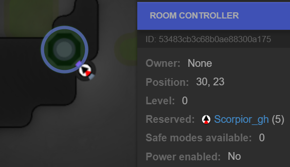
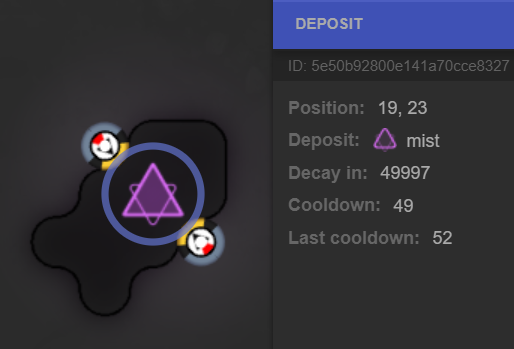
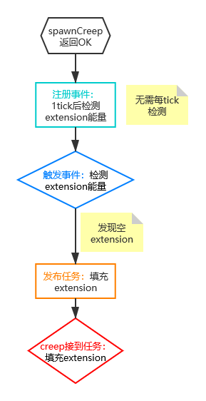

  
QQ群：565401831  
游戏介绍及入手请移步：[hoho大佬简书教程](https://www.jianshu.com/p/5431cb7f42d3)  
[系列目录](https://zhuanlan.zhihu.com/p/104412058)  
Version：1.1  
Author：Scorpior

# Screeps设计模式·事件模式

## 引言
入坑 Screeps 以后我们很快会发现自己在每 tick 对一些属性进行判断，比如判断某个角色的存活 creep 数量、判断 container 
是不是满了、判断 link 满了空了等等。而一经思考就很容易知道，creep 自然死亡的时间是*固定的 1500 tick*，container 从空到满的时间是 *container容量÷每tick放入的资源数*，
那么我们有没有什么办法让程序变得聪明一点，只在到了对应时间才进行判断处理呢？本篇介绍**极大节约与时间相关的逻辑判断开销**的一种手段。

“事件是等待发布的任务，任务是正在发生的事件”——我。

### 预备知识
#### JS 函数调用
在 JS 的有名函数（区别于匿名函数）中你可以获得一个 **this** 变量，这个变量最常用的作用是指类的实例对象，在使用``` . ``` 
运算符调用成员函数时 JS 底层会自动把运算符左边的对象绑定到运算符右边的函数的 this 指针上。
```js 
function 我的函数 () {
    this.某个键 = 1;
}

let 我的对象 = {f:我的函数};
我的对象.f();   // 此时 我的函数 操作的 this 就是 我的对象

console.log(我的对象.某个键);  // 输出 1
```
JS 提供了 **call()** 方法让我们手动指定 this 对象，call() 的第1个参赛会传给 this，后续参数被视为原函数的实参表
```js 
function 我的函数 () {
    this.某个键 = 1;
}

let 第一个对象 = {f:我的函数};
let 第二个对象 = {};
第一个对象.f.call(第二个对象);   // 此时 我的函数 操作的 this 就是 第二个对象

console.log(第一个对象.某个键);  // 输出 undefined
console.log(第二个对象.某个键);  // 输出 1
```
JS 中在函数调用时可以用 **...** 运算符把数组等可遍历类型展开成实参表
```js 
function f (a, b, c) {
    console.log(a + b + c);
}

f([1,2,3]);     // 输出字符串的拼接 1,2,3undefinedundefined
f(...[1,2,3]);     // 输出 6
```
#### 能量矿产量和 Reserve Room
能量矿 source 的刷新机制是一次**重置**后当储量**第一次小于储量上限时**启动倒计时 300 tick，计时归零时把储量**重置**为储量上限。因此自然刷新速率为 **储量上限÷300t** 。   
拥有控制器 controller 的房间在控制器中立时，储量上限为1500，对应的自然刷新率为**每 tick 5点**，在控制器被 claim 或被 reserve
时，储量上限提高到3000，产量为**每 tick 10点**。Reserve 控制器需要使用带有```CLAIM```部件的creep，算上```MOVE```的成本是650能量，每个
```CLAIM```部件每```reserveController```一次能获得 1 tick 的 reserve 时间，减去出生后 creep 走到外矿控制器的路程后每个```CLAIM```部件大概能
```reserveController```500次，在房间只有一个能量矿时收益是 5×500 - 650 = 2500 - 650 = 1850，如果房间有2个能量矿则收益4350。   
Reserve 时间上限 5000 tick，达到上限后如果用带多个```CLAIM```部件的 creep 继续```reserveController```则是在浪费 creep。
#### 任务的概念
参照[hoho大佬教程](https://www.jianshu.com/p/7226e08c4b8e)与[任务驱动案例](运输模式b.md)。

## 初步


帝国能量告急，现在准备开一个外矿房，为了提高产量，我们派出带8个```CLAIM```的 creep 去~~OOXX~~控制器。Creep 花费 50 tick 
从出生点走到了控制器上，它燃烧完剩余的 550 tick 生命顺利在牺牲时把 reserve 时间刷到了 3850 tick。因为 reserve 时间上限 5000 
tick，所以如果我们马上派接班 creep 去继续~~迫害~~控制器的话，在把5000刷满以后就会浪费 creep 的生命。因此我们希望在 reserve
时间损耗到阈值（比如500）以下时再派 creep 去工作。
```js 
// 自动生产 creep 的逻辑中
if (!外矿房间的controller.reservation || 外矿房间的controller.reservation.ticksToEnd < 500) {
    // 生一个用于 reserve 的 creep
}
```


帝国能量危机得到缓解，继续派出海外矿工去过道房采集 deposit。这个 deposit 已经被我们~~迫害~~到冷却时间为 52 tick，也就是采集一次后要等
51 tick 才能进行下一次采集。
```js 
// 挖 deposit 的逻辑中
if (!某个deposit.cooldown) {    // 冷却时间为0
    某个creep.harvest(某个deposit);
}
```
这两个```if```逻辑每 tick 都在运行，在有多个外矿房或者多个采集中的 deposit 时会有更多这样的```if```在持续运行，而这些逻辑的判断标准其实都是由时间决定的，我们可以通过
```Game.time```来算出需要进行工作的时间，在这个时刻直接进行工作不就好啦！为了在命运中的时刻到来时触发相应的工作，我们需要把工作信息存起来，一项工作称为一个**事件**，创建新事件称为**登记**，事件的执行称为**触发**。
```js 
let 生creep的事件 = {
    触发时间: Game.time + 外矿房间的controller.reservation.ticksToEnd - 500,     // 记录事件应该发生的绝对时间
    工作任务: 生一个用于迫害控制器的creep
};

let 挖deposit的事件 = {
    触发时间: Game.time + deposit.cooldown,
    工作任务: 控制某个creep采集某个deposit
}
```
然后让我们像机智过人的 **[@fangxm233](https://github.com/fangxm233) 大佬**一样使用一个简单对象来存储所有这些事件记录，至于这个简单对象具体放在哪个[存储位置](存储机制.md)请根据需求自己选。
```js 
// 在初始化代码中
let 计时器 = {}

function 加入计时器 (事件) {
    if (!计时器[事件.触发时间]) {    // 之前没有登记过这个时间的事件
        计时器[事件.触发时间] = [];  // 建立一个数组来存这个时间的事件
    }
    计时器[事件.触发时间].push(事件);  // 加入存储
}

// 在管理外矿的代码中
加入计时器(生creep的事件);

// 在挖 deposit 的代码中
加入计时器(挖deposit的事件);
```
然后在每 tick 运行的逻辑中，我们只需要管理这个计时器
```js 
if (计时器[Game.time]) {
    // 本 tick 有事件该发生
    for (let 事件 of 计时器[Game.time]) {    // 依次触发所有事件
        switch (事件.工作任务) {
            case 生一个用于迫害控制器的creep: {
                // 那就生一个吧
                break;
            }
            case 控制某个creep采集某个deposit: {
                某个creep.harvest(某个deposit);     // 只管挖不管运回家的大恶人
                break;
            }
        }
    }
    delete 计时器[Game.time];  // 删除处理完的事件，释放内存
}
```
这样我们把没工作时每 tick 需要运行的条件判断次数从2次减为1次，如果我们有n个类似的工作那么闲时的条件判断次数就**减少到1/n**。当然这样的机制对于每个事件也增加了**一次登记开销**和**一次触发开销**，对于数十 
tick 甚至更长时间才执行一次的工作来说，比每 tick 都要执行```if```更节约 cpu。
## 优化
类似任务机制一样，我们不希望触发事件时要使用 switch 进行多次判断，更不希望添加新事件时要修改这里的代码增加 
case，我们可以在事件信息中存储对应的工作函数。对于需要参数的函数，我们把参数也存进事件信息中。
```js 
// 在管理外矿的代码中
function 生creep的逻辑 (身体部件, 名字, 其他参数) {
    某个spawn.spawnCreep(身体部件, 名字, 其他参数);
}
let 生creep的事件 = {
    触发时间: Game.time + 外矿房间的controller.reservation.ticksToEnd - 500,     // 记录事件应该发生的绝对时间
    触发函数: 生creep的逻辑,
    参数: [身体部件, 名字, 其他参数]          // 用数组存储参数可以适应多个参数的情况
};
加入计时器(生creep的事件);

// 在管理计时器的代码中
if (计时器[Game.time]) {
    // 本 tick 有事件该发生
    for (let 事件 of 计时器[Game.time]) {    // 依次触发所有事件
        事件.触发函数(...事件.参数);
    }
    delete 计时器[Game.time];  // 删除处理完的事件，释放内存
}
```
进一步，如果我们的工作函数依赖于对象，像上面的 spawnCreep 需要对应的 *某个spawn*，我们可以对上面这个代码稍加修改：
```js 
// 在管理外矿的代码中
let 生creep的事件 = {
    触发时间: Game.time + 外矿房间的controller.reservation.ticksToEnd - 500,     // 记录事件应该发生的绝对时间
    触发函数: StructureSpawn.prototype.spawnCreep,  // spawnCreep 函数的原始指针
    参数: [某个spawn, 身体部件, 名字, 其他参数]          // 把 spawn 对象作为第一个参数
};
加入计时器(生creep的事件);

// 在管理计时器的代码中
if (计时器[Game.time]) {
    // 本 tick 有事件该发生
    for (let 事件 of 计时器[Game.time]) {    // 依次触发所有事件
        事件.触发函数.call(...事件.参数);     // call 把第一个参数绑定到触发函数内部的 this 上
    }
    delete 计时器[Game.time];  // 删除处理完的事件，释放内存
}
```
这样修改以后对于无需绑定对象的函数，我们只需记得在参数的开头加一个占位置的参数，就可以在 call 的逻辑下正常运行，比如：
```js
let 某个简单函数的事件 = {
    触发时间: 某个时间,    
    触发函数: 某个简单函数,  
    参数: [undefined, 有效参数]          // 把 undefined 放在第一个参数占位
};
```
有了 call 绑定对象，所有工作函数都可以像原本一样正常运行，不需要在工作函数内部代码中为对象机制做额外改动。

## 延伸
JS 中动态创建对象的开销较大，我们的事件对象其实不必每次登记时创建新的，只需要用旧的对象改一下属性值就可以再次登记到计时器中。

有了任务机制以后，再结合事件机制，我们可以形成**事件链**的概念，即“事件A的触发发布了任务α，任务α完成后登记事件B”这样的运行流程。这提供了全新的思路来设计我们的程序逻辑。


