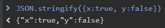
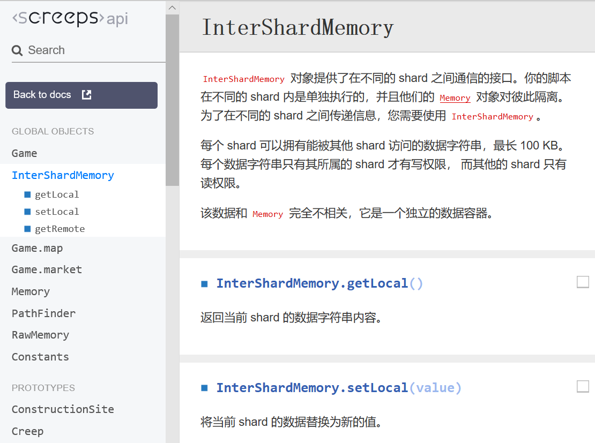
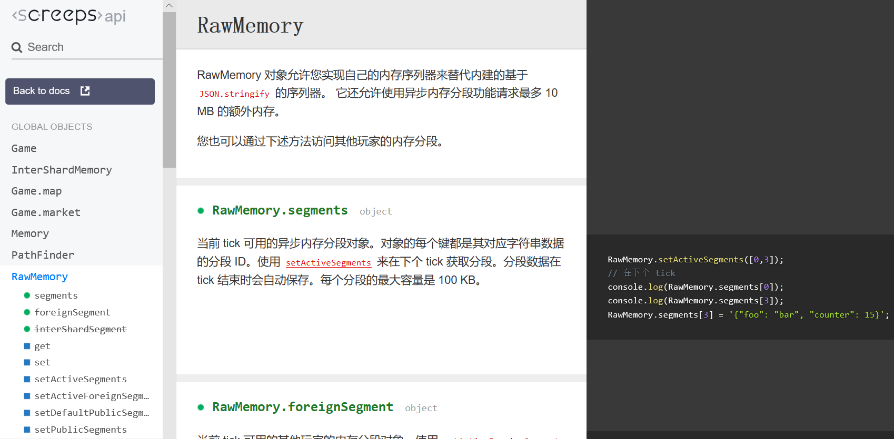
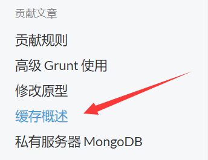
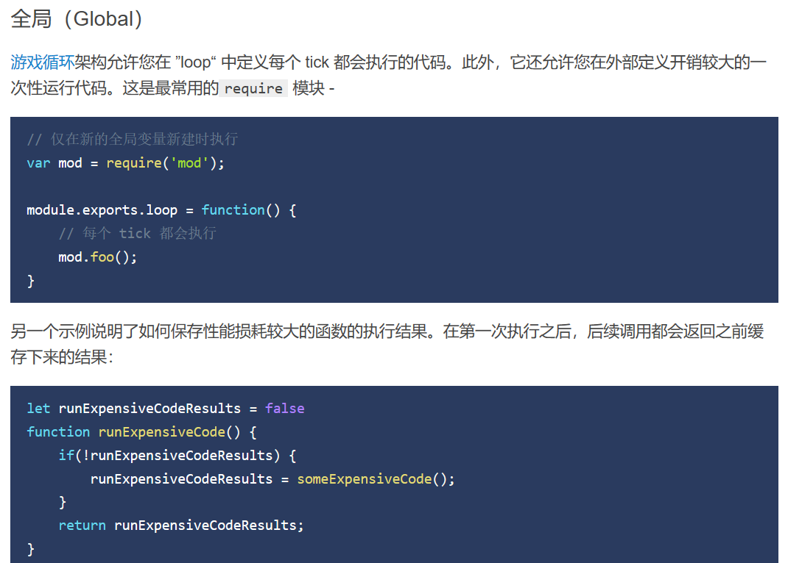
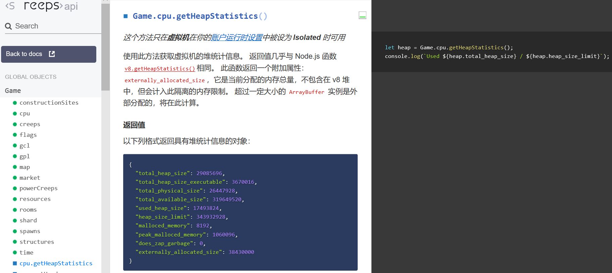
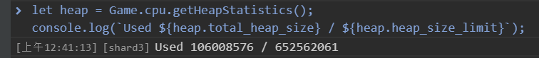

  
QQ群：565401831  
游戏介绍及入手请移步：[hoho大佬简书教程](https://www.jianshu.com/p/5431cb7f42d3)  
[系列目录](https://zhuanlan.zhihu.com/p/104412058)  
Version：1.1  
Author：Scorpior

# Screeps存储机制


## 引言
 Screeps 作为一款编程游戏，运行时间与运行空间就是对玩家发展的最大限制了，游戏 api 提供了多种方式供玩家存储数据，下面分为**正道**、**仙道**和**邪教**进行介绍。
 
### 预备知识
#### 全局重启 global reset
即重新开始运行你的代码，在你每次提交代码时就会发生，并且服务器会随机对你的代码进行**全局重启**。  
你代码中的所有语句都会在此时运行一次。
#### loop函数
指你在 **main.js** 文件中写的 **module.exports.loop** 这个函数，在每个 tick 都会运行一次，并且只会运行这个函数（当然也会运行这个函数中调用的其他函数），相当于C语言的main函数。没有在loop函数中调用的代码语句只会在**全局重启**时运行一次。
#### 全局变量 global
**global** 是游戏服务器提供的一个全局变量，类型是普通的 JS 对象，也就是和你用  
```js
let 我的变量 = {};
```
创建的变量类型一样。这个变量及其值域可以在任一代码文件中访问，也就是可以在一个文件中赋值而被其他文件读到。
## 正道
 

#### 描述
官方从新手教程开始就疯狂安利大家用 Memory 对象存储数据，
所以就把 Memory 看作游戏中最基本的**跨 tick 存储数据**的方式吧~。  

首先需要理解的是这个 **Memory** 并不是真正的物理内存，只是一个普通的 JS 对象，和上面提到的 global
对象类型一致。Memory 对象唯一特别的地方在于它会**每 tick**
被服务器自动转化为字符串保存起来，也就是在每 tick 
中你的代码第一次使用这个对象时服务器自动调用 **JSON.parse()**
函数来将存储的字符串还原成对象给你，你的代码运行完后服务器自动使用 **JSON.stringify()** 
函数再将它序列化成字符串。服务器通过这个机制来使你存储在 Memory 中的数据不会在跨
tick 时丢失，也能**在全局重启时仍然延续保存**。  

当然这样的保存过程也有其**缺点**。首先是 JSON 序列化和解序列化的 cpu 开销会随着你
 Memory 中数据容量增加，没有人不想节省 cpu 。其次是只有 **简单数据类型**（数字、字符串、布尔值）、**基本对象{}** 
以及 **基本数组[]** 可以在序列化和解序列化中正确保存，像函数等复杂对象在经过序列化后会**失去上下文及原型链**（不了解JS原型链的童鞋自行百度），也就无法正常工作。  

还需要注意的是每个玩家使用 Memory 存储的数据量上限是 2MB， 这指的是经过序列化后的字符串占的空间。像下面这样一个只包含两个布尔值的简单对象，经过序列化后将变成长度为20个字符的字符串，如果考虑一个字符占用 1B 的存储空间则一共要 20B， 远大于2个布尔值本身的各 1B 的空间开销。



#### 推荐用法
新手玩家可以方便地通过```creep.memory```、```spawn.memory```、```room.memory```和```flag.memory```来使用 Memory。  

Memory 具备的**全局重启时不丢失的特性**使其非常适合存储一些提交代码时不需改变，并且不容易从当前
 tick 的游戏数据中直接得到的数据，比如玩家手动配置的临时设置、外矿相关信息、过道房相关信息等。（外矿和过道房不一定有视野）  

Memory 小容量和不会自动删除垃圾数据的特点要求使用时注意自行删除过期数据。  

Memory 也是使用 [Grafana](https://screepspl.us/services/grafana/) 进行数据可视化的必要存储位置。

## 仙道
除了 Memory 对象以外，游戏api还提供了两个对象给我们存储数据，分别是 **InterShardMemory** 和 **RawMemory**。 
#### InterShardMemory


**InterShardMemory** 对象的本意是让玩家跨镜面（shard）给自己的代码传递数据，它在存储时是和 
Memory 对象一样转化为字符串。我们可以使用 **InterShardMemory.getLocal()**
来获取存储的字符串，并通过 **InterShardMemory.setLocal()** 将字符串数据存入 
InterShardMemory。简便起见可以直接使用 JSON 库函数进行序列化及解序列化。
```js
let 存储的数据 = JSON.parse(InterShardMemory.getLocal() || '{}')  // 如果没有数据则将空对象作为存储的数据

/*
 *  一顿操作
 */
 
InterShardMemory.setLocal(JSON.stringify(新的数据));  // 将新的数据进行序列化存储
```
相对 Memory 而言，InterShardMemory 的使用需要增加一点手动操作，但也因此可以更好地控制不必要的 cpu 浪费。每个人在同镜面（即通过 setLocal() 能存储的）数据量为 100KB，比 Memory 对象还少，不过蚂蚁也是肉~。

#### RawMemory


**RawMemory** 对象本意是供不同玩家之间传递数据时使用，同时也提供了相对更加个性化的存储接口。  
 RawMemory 中的存储空间一共有 10MB ~~（是不是可以让 Memory 重度依赖症患者抢救一下了）~~，被划分为100个段（segment）编号0至99，每个段容量 100KB。段中的数据同样是一个字符串，但更加繁琐的是对于 
 RawMemory 我们无法在当前 tick 直接获取想要的段，而是要通过 **RawMemory.setActiveSegments()** 
 函数指定我们想要的数据段，在下一 tick 时才能通过 **RawMemory.segments** 拿到这些字符串。简单的使用方式如下
```js
RawMemory.setActiveSegments([0,5,7]) // 声明我们想要0号、5号和7号段

// 下一tick
let 存储的数据 = JSON.parse(RawMemory.segments[0] || '{}')  // 使用0号段中的数据
/*
 *  一顿操作
 */
RawMemory.segments[0] = JSON.stringify(新的数据); // 将新的数据存回去
``` 
类似地你可以通过[api](https://screeps-cn.github.io/api/#RawMemory)获取别的玩家公开的数据及设置自己的公开数据。

RawMemory 相对充裕的容量可以很好地补充 Memory 对象较小的容量 ~~（虽然一般人用不完 Memory 空间）~~，并且其分段存储机制允许你只获取自己想要的部分数据，节约序列化和解序列化开销。

#### 推荐用法
发挥 InterShardMemory 和 RawMemory 的原本作用——跨镜面传递数据和玩家间传递数据。  

InterShardMemory 和 RawMemory 与 Memory 相似的不随全局重启丢失的特点使其同样适合存储不便于每 
tick 重新计算的临时信息，同时因为只能主动获取，也就不会在无需读取时被自动获取浪费 cpu。

## 邪教
说了这么多，好像我们最初面临的问题还是没有解决——怎么样才能存储函数和复杂对象呢？细心的好奇宝宝们一定在[docs文档](https://screeps-cn.github.io)中发现了下面这个条目



点进去发现一片新天地



模仿着在 main.js 里这么写
```js 
let 我的小兔兔 = 兔宝宝;
module.exports.loop = function () {
    if (我的小兔兔 == 兔宝宝) {
        我的小兔兔 = 大兔兔;
    } else if (我的小兔兔 == 大兔兔) {
        我的小兔兔 = 烤兔兔;
    } else if (我的小兔兔 == 烤兔兔) {
        我的小兔兔 = 兔骨头;
    }
    // 一系列惨无人道的变化
}
```
我们会发现 ~~ReferenceError: 兔宝宝 is not defined~~ *我的小兔兔* 逐一 tick 经历了从 *兔宝宝* 到 *烤兔兔* 的变化，也就是**上一 
tick 对数据的改动得到了保留**。这是因为变量 *我的小兔兔* 在**全局重启**时被赋值为 *兔宝宝* 之后存储在程序缓存（cache）中，每 
tick 中loop函数运行时仍然能读取到这个变量。我们将这样loop函数以外的代码称为**初始化代码**，loop函数及其中调用的函数称为**工作代码**。像这样存储的变量我们称为**局部缓存变量**，只有在同一文件中才能读取到（基础知识自行百度程序命名空间），如果想定义真正的**全局变量**则需要**挂载**在 
**global** 对象（称为全局缓存对象）上：
```js 
// 在一个文件中
global.我的小兔兔 = 兔宝宝;

// 在另一个文件中
function () {
    if (我的小兔兔 == 兔宝宝) {    // 可以直接读取到变量
        我的小兔兔 = 大兔兔;
    }else {
        // 依次发生惨无人道的变化
    }
}
```
就可以同样实现 *我的小兔兔* 的一系列变化 ~~ReferenceError: 兔宝宝 is not defined~~ 
。通过这样的方式我们可以存储任意数据，是不是超级方便！更加可喜可贺的是，我们还能看见一个这样的api：


它告诉我们可以这样获取程序的运行空间信息，我们将示例代码输入官服控制台一看



我们的程序运行栈一共有 652MB ！已使用空间只占了 106MB ！也就是我们在局部缓存变量和全局变量上存储的数据可以多达 500MB 左右，我还要什么~~自行车~~ Memory 
？！  
既然如此方便又大容量，我们为什么还要管 Memory 
等几个限制重重的对象呢？这是因为局部缓存和全局变量都会**在全局重启时清空**，然后被你的**初始化代码**赋值为初始值。因为服务器重启你的代码是个不可控的随机事件，所以如何避免全局重启时数据丢失导致的程序错误是使用局部缓存与全局变量时的核心难题。  

这里提供几个思路：
* 在局部缓存或全局变量中存储常量，初始化的值就不会被改变
* 定期（比如每 k tick）将数据存放到 Memory 等非易失位置，在初始化代码中读取存储的值（即数据回滚至多 k tick）
* 在初始化代码中通过自己设计的方法重新计算出正确的值，让工作代码可以无缝运行
#### 推荐用法
复杂对象及函数只能存在这里。  

缓存一些 cpu 开销大的代码的计算结果。  

储存任何你有能力通过代码恢复，不会因为丢失而导致运行错误的数据。

## 总结
除去跨镜面传递数据、玩家间传递数据和 [Grafana](https://screepspl.us/services/grafana/) 统计数据这3个规定了存储位置的需求外，我们的数据可以分为如下几类：
* 用于节省 cpu 的缓存数据，如建筑物id、creep名字等，每 tick 都能重新获取或者需要使用时总能重新计算，适合存在全局缓存或者局部缓存，**发现数据不存在时重新计算**
* 用于短时间内改变运行行为的数据， 
如玩家下达的进攻任务、资源发送任务、扫描到的 [PowerBank](https://screeps-cn.github.io/power.html#超能宝库（Power-Bank）) 
或者 [Deposit](https://screeps-cn.github.io/resources.html#采集) ，不方便每 tick 重新获取，
适合存在 Memory、InterShardMemory 或 RawMemory 这三个对象中，具体选择看你的数据量和使用习惯。
同时注意删除垃圾数据避免内存泄露。建议在全局缓存中定义用于玩家手动下达任务的函数
    ```js
    // 初始化代码中
    global.下达指令 = function (参数) {
        // 你的代码
        return '收到'
    }
    
    // 控制台中
    > 下达指令(xxx)
    < 收到
    ```
* 固定的永久配置数据，如 creep 的角色和体型等，适合写在代码里
## 魔教
什么你说你要用 creep 的名字存储数据？  

flag 名也要用？  

新建一个 spawn 来存？


#### 推荐用法
无