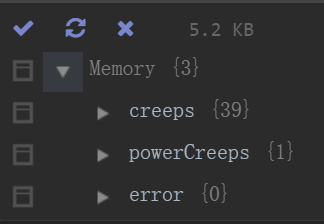
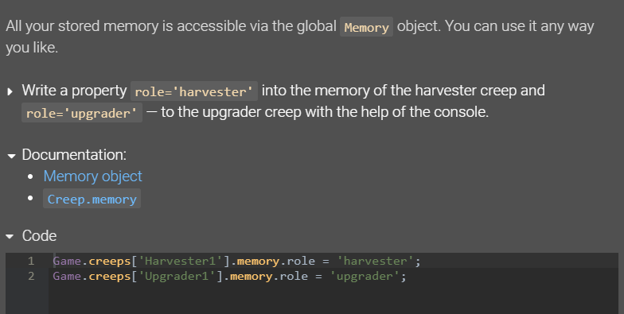

  
QQ群：565401831  
入门请移步：[hoho大佬简书教程](https://www.jianshu.com/p/5431cb7f42d3)  
[系列目录](https://zhuanlan.zhihu.com/p/104412058)  
Version：1.0  
Author：Scorpior

# Screeps存储机制


## 引言
 Screeps 作为一款编程游戏，运行时间与运行空间就是对玩家发展的最大限制了，游戏 api 提供了多种方式供玩家存储数据，下面分为**正道**、**仙道**和**邪教**进行介绍。
 
## 预备知识
#### 全局重启 global reset
即重新开始运行你的代码，在你每次提交代码时就会发生，并且服务器会随机对你的代码进行**全局重启**。  
你代码中的所有语句都会在此时运行一次。
#### loop函数
指你在 **main.js** 文件中写的 **module.exports.loop** 这个函数，在每个 tick 都会运行一次，并且只会运行这个函数（当然也会运行这个函数中调用的其他函数），相当于C语言的main函数。没有在loop函数中调用的代码语句只会在**全局重启**时运行一次。
#### 全局变量 global
**global** 是游戏服务器提供的一个全局变量，类型是普通的 JS 对象，也就是和你用  
```js
let 我的变量 = {};
```
创建的变量类型一样。这个变量及其值域可以在任一代码文件中访问，也就是可以在一个文件中赋值而被其他文件读到。
## 正道
 

####描述
官方从新手教程开始就疯狂安利大家用 Memory 对象存储数据，所有就把 Memory 看作游戏中最基本的**跨 tick**存储数据的方式吧~

####推荐用法
Memory 具备的 global reset (下文会解释这是什么)时不丢失的特性使其非常适合存储一些提交代码时
不需改变，并且不容易从当前 tick 的游戏数据中直接得到的数据，比如玩家手动配置的临时设置、外矿相关信息、过道房相关信息等。（外矿和过道房不一定有视野）  
Memory 小容量和不会自动删除垃圾数据的特点要求使用时注意自行删除过期数据。  
Memory 也是使用 [Grafana](https://screepspl.us/services/grafana/) 进行数据可视化的必要存储位置。

## 仙道

#### 推荐用法
发挥 InterShardMemory 和 RawMemory 的原本作用——跨镜面传递数据和玩家间传递数据。  
InterShardMemory 和 RawMemory 与 Memory 相似的不随 global reset 丢失的特点使其同样适合存储不适合每 tick 重新计算的临时信息，同时因为只能主动获取，也就不会在无需读取时被自动获取浪费 cpu。

## 邪教
#### 推荐用法
无

## 总结
除去跨镜面传递数据、玩家间传递数据和 [Grafana](https://screepspl.us/services/grafana/) 统计数据这3个规定了存储位置的需求外，我们的数据可以分为如下几类：
* 用于节省 cpu 的缓存数据，如建筑物id、creep名字等，每 tick 都能重新获取或者需要使用时总能重新计算，适合存在全局缓存或者局部缓存，**发现数据不存在时重新计算**
* 用于短时间内改变运行行为的数据， 
如玩家下达的进攻任务、资源发送任务、扫描到的 [PowerBank](https://screeps-cn.github.io/power.html#超能宝库（Power-Bank）) 
或者 [Deposit](https://screeps-cn.github.io/resources.html#采集) ，不方便每 tick 重新获取，
适合存在 Memory、InterShardMemory 或 RawMemory 这三个对象中，具体选择看你的数据量和使用习惯。
同时注意删除垃圾数据避免内存泄露。建议在全局缓存中定义用于玩家手动下达任务的函数
    ```js
    // 初始化代码中
    global.下达指令 = function (参数) {
        // 你的代码
        return '收到'
    }
    
    // 控制台中
    > 下达指令(xxx)
    < 收到
    ```
* 固定的永久配置数据，如 creep 的角色和体型等，适合写在代码里
## 魔教
