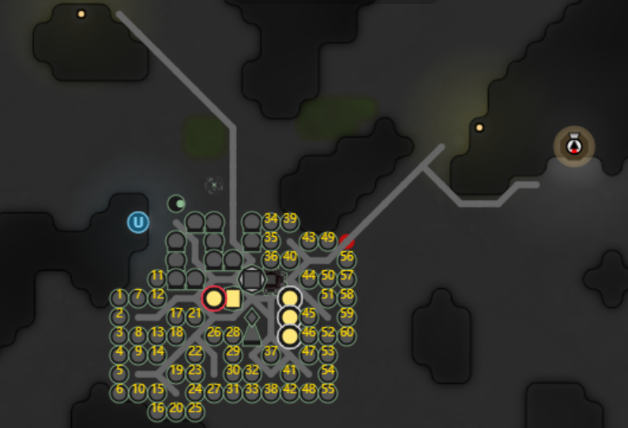
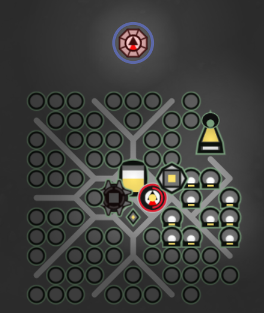
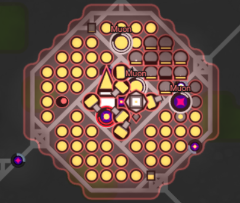
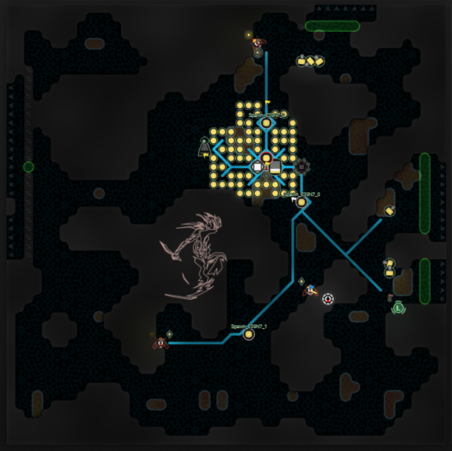
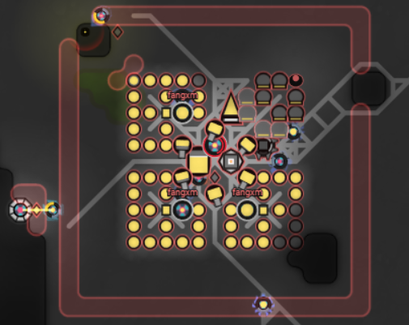
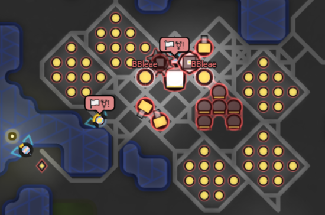
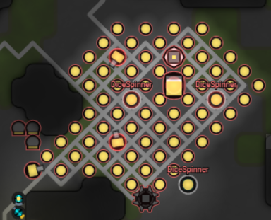
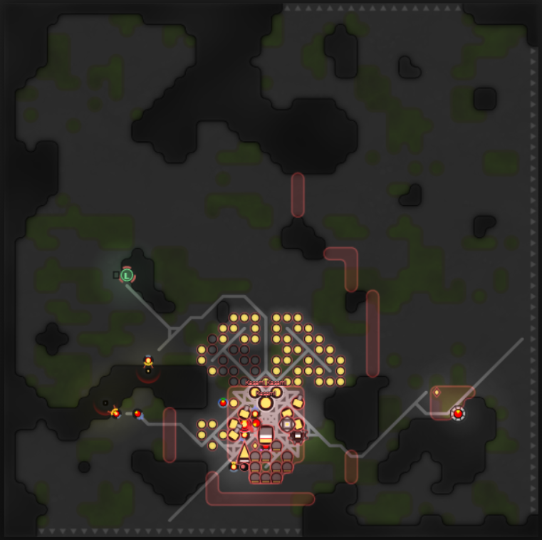

  
QQ群：565401831  
游戏介绍及入手请移步：[hoho大佬简书教程](https://www.jianshu.com/p/5431cb7f42d3)  
[系列目录](https://zhuanlan.zhihu.com/p/104412058)  
Version：1.0   
Author：Scorpior   

# 自动规划


## 引言
自动规划，英文 auto-planning（或者叫房间规划 room planning），在 Screeps 中指的是自动计算自己房间中每个建筑该在什么位置建造。有建筑工 creep 的代码后（没有的话快去教程里 copy 一个），配合自动规划的结果来自动在相应位置摆放工地，就可以实现房间的全自动升级。

自动规划是 Screeps 里少有的纯算法问题，输入是一个房间的地形图的静态数据，输出每个建筑的位置。整个问题由2~3种算法完成，下面逐一介绍。

本篇偏重算法，没有特别新奇的设计思想。

### 预备知识
定义一下本文将用到的几个概念。
#### 墙点
不可拆除的墙所在的位置称为墙点，通过`room.getTerrain().getRawBuffer()`获得地形数组后，对于一个`{x,y}`的位置，可以这样判断是否是墙：
```js 
if (terrain[y*50 + x] & TERRAIN_MASK_WALL) {
    // 是墙
} else {
    // 不是墙
}
```
#### 资源点
这里我们指在房间地图上天然就有的 source、mineral 和 controller，它们的共同特征是都不可通行，不可修路。占领时一般只考虑有2个 source 的房间，那么房内会有**4个资源点**。

## 流程
### 选择空地
我们第一步需要知道哪些位置可以摆建筑，有2个要求：
1. 找到足够大的空地
2. 选择距离资源点总路程最近的空地

这里有2个流程可以完成任务：
1. 计算出所有可行的空地，对每个空地执行4次`PathFinder.search()`获得到资源点的总路程
2. 计算出房间所有非墙点到资源点的总路程，然后每个可行的空地直接读取总路程即可

为了**控制计算量**，我选择第2种先计算每个资源点的路程图。
#### 计算路程图
因为修路以后沼泽和平原的移动时间相同，所以全部的非墙点可以视为一个无向无权图，取一个资源点用**广度优先遍历**就可以得到它到所有非墙点的距离。伪码如下：
```js 
function 计算一个资源的路程图(资源点pos，terrain) {
    let 待访问点集合 = [资源点pos];      // 初始化广度优先队列
    let 已知路程集合 = {资源点pos: 0};   // 起始位置路程为0
    for (let pos of 待访问点集合) {   // 遍历广度优先队列
        for (let 邻居pos of pos的八个方向相邻节点) {
            if (已知路程集合.has(邻居pos) || terrain[邻居pos.y*50 + 邻居pos.x] & TERRAIN_MASK_WALL) {   // 已访问过的点或者墙点
                continue;   // 无需访问
            }
            已知路程集合.add(邻居pos, pos.路程+1);    // 伪码，设置邻居节点是本节点路程+1
            待访问点集合.push(邻居pos);     // 把新节点加入广度优先队列
        }
    }
    return 已知路程集合;
}
```
`计算一个资源的路程图()`这个函数得到一个资源点的路程图，对4个资源点各调用1次就得到4个路程图，每个 pos 的路程按权重相加就可以得到总路程（代价）。这里的权重可以使得不同资源点对总路程有不同的影响力，总路程最小的点会靠近权重大的资源点。
```js 
function  计算总路程图(所有资源点, terrain) {
    let 总路程图 = 全0的二维数组;
    for (let 资源点 of 所有资源点) {
        let 一个路程图 = 计算一个资源的路程图(资源点, terrain);
        for (let pos of 一个路程图) {
            路程图[pos].路程 += 资源点.权重 * 一个路程图[pos].路程;  // 伪码
        }
    }
    return 总路程图;
} 
```
这里的`总路程图`就是一个房间所有可行走位置的**代价数组**了，每个位置对应一个数字作为代价值。
#### 计算空地面积
为了方便资源运输，我们的多数建筑都适合集中摆放，所以我们要避免在过于狭窄的地方开始建造。房间是个 
50*50 矩阵，其中墙点可以视为0，非墙点视为1，统一考虑正方形空地的话，这就是个“在01矩阵中寻找最大的全1正方形”的经典动态规划问题。不过我们的目标不是找到最大的正方形，而是**记录所有足够大的正方形**，这里足够大的阈值就是你规划的建筑布局的边长。算法大致如下：
```js
function 找到所有能摆得下建筑的空地(terrain, threshold) {
    let buffer = 边长50的全0二维数组;   // 数组中的数字代表以这个点为右下角的最大空地正方形的边长
    let anchors = [];   // 用于记录所有足够大的正方形的右下角坐标
    
    // 初始化 x=0 和 y=0 两条边
    for (let y = 0; y<50; y++) {    // x = 0
        if (!(terrain[y*50] & TERRAIN_MASK_WALL)) {     // 如果是空地
            buffer[0][y] = 1;   // 有边长为1的正方形空地
        }
    }
    for (let x = 0; x<50; x++) {    // y = 0
        if (!(terrain[x] & TERRAIN_MASK_WALL)) {     // 如果是空地
            buffer[x][0] = 1;   // 有边长为1的正方形空地
        }
    }
    
    // 动态规划遍历所有点
    for (let x = 1; x<50; x++) {
        for (let y = 1; y<50; y++) {
            if (!(terrain[y*50 + x] & TERRAIN_MASK_WALL)) {     // 如果是空地
                buffer[x][y] = 1 + min(buffer[x-1][y-1], buffer[x-1][y], buffer[x][y-1]);   // 递推公式
                if (buffer[x][y] > threshold) {     // 大于阈值
                    anchors.push([x, y]);   // 记录坐标
                }
            } // else buffer[x][y] = 0 即初始值
        }
    }
    
    return anchors; // 返回所有足够大的正方形右下角坐标
}
```
如果得到的 anchors 是空数组，那么这个房间就无法摆下我们的建筑布局，可以选择放弃这个房间或者修改布局。在 anchors 非空的情况下，我们遍历其中的点，计算对应的正方形（的中心点）在前面总路程图上的代价，就可以选取代价最小的位置来摆放我们的布局啦。
### 基本建筑
在找到合适的空地后，我们的 road、wall 和 rampart 
仍然是需要考虑不同房间的地形的，所以我们不妨先把其他建筑的位置算好再考虑它们。可以在布局中固定摆放的建筑就称作基本建筑。我们在官网上可以找到[模拟房间](https://screeps.com/a/#!/sim/custom)，在这里我们能把布局中相对位置固定的所有建筑摆好，然后在布局中**选取一个基准点记录它们的相对坐标**，这样我们就能在刚才选取的空地中根据相对坐标摆放这些建筑了。



### 铺路
铺路包括**往4个资源点铺路**和**判断出入房间的路有没有被堵死**，共同流程都是用 **PathFinder** 搜索一条从我们准备摆 storage 的位置到目标点的路径，看这条路径有没有经过我们刚才准备摆的不可行走的基本建筑。因为我们的建筑还没有实际建造，如果只是按基本地形寻路的话，寻路结果很容易经过我们的建筑，所以我们要**修改一下 CostMatrix** 让寻路算法在一定程度上绕开我们的建筑。
```js 
function modifyCostMatrix(预计建筑位置) { 
    /** 设置考虑建筑位置的 costMatrix */
    let costMat = new PathFinder.CostMatrix;
    for (let pos of 预计建筑位置) {
        costMat.set(pos.x, pos.y, 15);  // 设置代价为15，也就允许绕15格平地来避开建筑，仍没有路就踩上建筑。代价值按个人喜好。
    }
    return costMat;
}

function checkRoad(预计建筑位置, 资源点位置数组, 房间出口数组) {
    let costMat = modifyCostMatrix(预计建筑位置);
    
    for (let 目标位置 of 资源点位置) {
        let ret = PathFinder.search(
            storage位置,
            目标位置,   // 4个资源点之一
            roomCallback: roomName => costMat,  // 按修改后的 costMatrix 寻路
            maxRooms: 1     // 只考虑此房间
        )
        
        if (ret.path 不经过建筑位置) {     // 伪码
            在 ret.path 的每一格上铺路
        } else {    // 这里意味着到某个资源点的路被建筑堵死了
            调整建筑位置
        }
    }
    
    for (let 目标位置 of 房间出口数组) {   // 这里数组中对于房间每个方向的出口只需要采用一个点
        let ret = PathFinder.search(
            storage位置,
            目标位置,   // 房间出口之一
            roomCallback: roomName => costMat,  // 按修改后的 costMatrix 寻路
            maxRooms: 1     // 只考虑此房间
        )
        
        if (ret.path 经过建筑位置) {     // 出房间不一定要铺路，因人而异
            调整建筑位置
        }
    }
}
```
得到 PathFinder 的结果后，如果不可避免要踩上建筑，那么我们要修改建筑位置来让出道路。为了提前避免这种情况，我们可以在建筑布局外围纳入一整圈路（或者空地），保证从布局边缘每个点都可以走。否则也有两个修改建筑的思路，一是旋转布局改变朝向重新尝试寻路，二是把寻路踩上的建筑逐一挪动到旁边可行位置，注意仍要保持其他路径通畅且这个建筑也可达。上方标题图中路底下有红点的位置就是我的算法中挪动过堵路建筑的位置。
### 修墙
经过上面这一套流程，我们终于把绝大多数建筑摆好了，只剩下防御建筑了。这里介绍三种相对简单的修墙思路，并且只修 rampart 来忽略人造 wall
的堵路问题（堵路可以和建筑堵路类似处理）。
#### 全覆盖


用 rampart 覆盖整个建筑布局是最简单的方法，因为建筑位置肯定不是墙点，直接铺一遍就行了。OverMind 就采取这种方案，同时能获得全建筑防核弹的效果，缺点是因为 rampart 数量多导致维护费高昂。
#### 贴出口


沿房间出口修一圈墙，代码也很简单，好处是让别人无法同时把大量兵力投入你的房间，利用游戏机制削弱攻击强度，缺点是这样塔的火力分散且出口宽阔的房间需要大量 rampart。
#### 布局扩三格


这样摆 rampart 是既可以让 tower 强大火力覆盖 rampart，又节省 rampart 数量。距离其他建筑3格远使得在 rampart 被摧毁前别人的远程 creep
也无法攻击到自己的建筑。代码遍历4条边上不是墙点的位置即可。

## 延伸
上文中我们已经完成了一个可行的自动规划方案，但“Screeps 建筑学”仍然是一个很有趣的问题。我们通常从三个角度考虑建筑的摆放问题：
* **效能**：怎么样减少建筑位置导致的损耗，这包括路和 rampart 的维修开销、运输物资的成本、creep 离开房间的路程开销等。
* **鲁棒性**：能否适应较差的房间地形。
* **攻防**：敌人进攻时我方被动防御和主动防御的有效性，这和战斗代码逻辑密切相关，通过建筑位置配合战斗逻辑发挥最大效果。
### 移动核心位置
通常我们的核心建筑造好之后就不移动，但也有例外，主要是两种情况：
1. 别人采取核弹攻击，我方移动建筑比修 rampart 更划算；
2. 未满级房间打算高速冲级，此时把 storage 和 terminal 直接摆在 controller 边上效率最高，而到 RCL8 后 controller 位置不需要大量能量流通了，核心建筑可以摆在距离其他点位更近的位置提高长期效能。

这种在已有建筑时进行移动需要规划好拆除与新建的逻辑。
### 自适应布局
很多建筑不需要定死位置，而是可以根据一定的规则来适应地形，标题图中的布局就是自动计算 extension 位置适应墙壁的例子。除了我那样全部 extension 都灵活计算位置的密铺布局外，还有两种思路：
1. 把建筑分块，每块单独找一个位置  



2. 按一定的间隔规则建造



### 最小割修墙
最小割（min cut）是图论中的概念，意思是在一张连通图中，寻找最小的边集（或者点集），使得去掉这些边后的图变成两个互不连通的部分。应用在 screeps 里就是寻找最少的点位集合，使得在这些点上修墙后，就能把你的核心建筑和（与房间入口连通的）墙外区域分割开，不存在不经过墙就能进入你的建筑群的路径。OverMind 库里有[该算法的代码](https://github.com/bencbartlett/Overmind/blob/master/src/algorithms/minCut.ts)。




