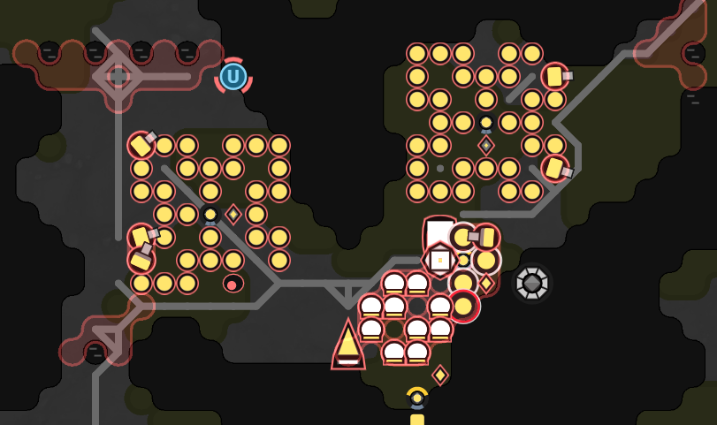

  
QQ群：565401831  
游戏介绍及入手请移步：[hoho大佬简书教程](https://www.jianshu.com/p/5431cb7f42d3)  
[系列目录](https://zhuanlan.zhihu.com/p/104412058)  
Version：0.1   
Author：Scorpior   

# 系统性节约 CPU

## 引言
CPU 是 screeps 游戏中最重要的资源，也是目前（2020.5.7）官方唯一以现实货币出售的一种资源。如何用好有限的 CPU 是贯穿游戏始终的问题。

hoho大佬[已经分析了几种典型的 CPU 开销](https://www.jianshu.com/p/00d5df1ada03)，其中的**固定消耗**非常值得我们注意，这意味着 creep 的每个动作都会带来 **0.2CPU** 的高额开销，这大概相当于用`array.forEach(e=>e)`遍历一个长度10000的`Array`，或者在同一个房间执行**600次**`room.find(FIND_SOURCES)`。可见只要减少一次动作，省下的 cpu 就可以额外执行很多逻辑计算了。

本文关注**节约固定0.2开销**的问题，从提升效能、布局优化、优化调度3方面考虑。

### 预备知识
#### 哪些动作会有 0.2CPU
完整的列表很长，具体可以去[API文档](https://screeps-cn.github.io/api/)看每个函数词条的右上角表识，不过这里也介绍一些概念。
1. 游戏内建筑和单位的动作基本都有固定开销
    * creep 和 powerCreep 的方法除了`cancelOrder()`、`say()`和（creep 的）`pull()`以外都有固定开销，其中`cancelOrder()`**不会返还**之前其他方法在返回 OK 时已经扣掉的 0.2CPU。
    * `lab.runReaction()`、`spawn.spawnCreep()`等和所有的`destroy()`都有固定开销，**特别注意`observer.observeRoom()`**也有。
1. 市场中会引起订单数据改变的方法都有开销
    * 市场的`createOrder()`、`extendOrder()`、`cancelOrder()`以及`deal()`都有固定开销，而且`deal()`很容易因为别人也在 deal 而变成白白浪费 0.2CPU。
1. 工地和旗子的操作也算动作
    * 新建和删除 constructionSite、新建和移动以及删除 flag 都有固定开销。
1. powerCreep 的创建、升级、删除也有固定开销

#### move 不会检测撞墙
`creep.move()` 只需要传入的参数是方向常数或者相邻的 creep 就会返回 OK，所以很可能产生**虚假移动**浪费固定开销，这通常发生在 creep 已经处于 source 或 storage 等建筑的相邻格时仍然对这个建筑使用`creep.moveTo()`。
   
##  提升效能
和上面提到的hoho文章中提到的一样，增加每次动作的效果就可以减少动作次数而保持工作效果。比如修建一个 100K 的工地，用 1WORK 的 creep 需要修 20K 次，多个相同的 creep 虽然能加快修建速度但不会减少动作次数，如果使用 10WORK 的 creep 就可以把动作次数减到 2K 次，也就**直接减少了 3600CPU 的开销**。powerCreep 的许多技能都可以提升动作效果，比如对 lab 和对 powerSpawn 使用的技能。

## 布局优化

在hoho的[布局规划](https://www.jianshu.com/p/bf849b5b47bd)中介绍了一些房间布局模式，其中在 spawn 位置选择中也已经涉及了缩短路程的考虑。在所有的建筑物摆放中，我们都可以**通过缩短路程来减少移动所需 CPU**。

对于每个建筑，我们需要考虑他会涉及 creep 的哪些工作。比如 spawn 涉及新生 creep 的上岗和能量填充，所以它离 creep 的工作位置越近越好、离能量供给点越近越好。初始 spawn 放在 source 和 controller 路程的中心可以**既方便 creep 上岗**也**利于 creep 从 source 运能量回来填充**。类似地，把 extension 和 tower 摆在靠近 storage 的地方一般也比摆的远更好，下图这种在新手房间中常见的布局**在很多情况下远没有集中式布局容易填充**。    
   

在 link 的帮助下，以 link 为中心构建多个建筑群也是一个不错的思路，下图中展示了ART999大佬的布局。   
   

storage、terminal、factory、powerSpawn 这几个建筑之间经常会有**大量的资源转运需求**，把它们摆的越近就越能节约平时的运营开销并提升工作速度，这就产生了“**核心区**”的概念，lab、nuker 和 tower 也可以按个人观念加入核心区。一般的设计都会让几个大容量建筑之间有**无需移动就能运输资源的位置**，然后 lab 和 tower 等也**优先摆在两三步以内**。上面几个布局都体现了这种设计。

## 优化调度

调度是指在多个可能的方式中选择（安排）其中一种完成工作的方式，这里我们主要是可以通过**安排最近的资源建筑**和**安排最短的 creep 路线**来减少 move 的固定开销。调度功能一般都需要更多的逻辑代码才能实现，只有**减少的固定开销大于增加的逻辑开销**才能真正获得收益，所以在实际运用中需要进行一些开销测试。

**资源建筑匹配**的常见例子比如，在用 container 挖矿和升级的 RCL4 房间中， 把矿点 container 中的能量直接运到升级处，会比死板地运回 storage 再从 storage 拿到升级点更省事。类似地，在压缩矿物或者合成化合物的时候，把 mineral 处的矿物直接运进 factory 或者 lab 也是节省了固定开销。

**安排最近的 creep 工作**其实有很多应用，首先是有多个空闲运输工时选择距离资源建筑最近的运输工去搬运，此外还有在 creep 建造或维修建筑时，让它去最近的 container 或者 link 取资源会比固定回 storage 取更省。如果采取了超额部件（多于5个 WORK）的矿工挖 source，那么在资源挖干后利用空闲时间维修身边的 road 和 container 也是个好主意。

## 总结
增大 creep 体型和设计建筑布局这样的方法，并没有对算法逻辑进行显著改动，而是在 creep 的出生阶段或者建筑建造阶段的一些改动，就**在 creep 或者建筑的终生工作中减少了 CPU 开销**，所以我称其为系统性节约 CPU。上述这三方面优化都不会像减少冗余代码那样能直观感受到节省计算时间，但都会体现在长期的**总平均 CPU** 上，甚至可能比减少很多代码更加有效。