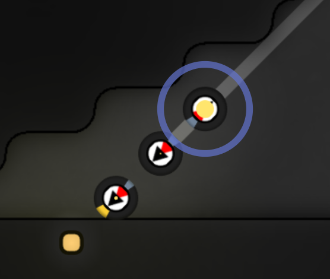

  
QQ群：565401831  
游戏介绍及入手请移步：[hoho大佬简书教程](https://www.jianshu.com/p/5431cb7f42d3)  
[系列目录](https://zhuanlan.zhihu.com/p/104412058)  
Version：1.0  
Author：Scorpior

# Screeps 运输模式（一）流模式


## 引言
Screeps 中绝大多数物资运输都要依靠 creeps 完成，如何灵活地完成采矿、升级、factory、lab 
等的物资运输需求是一个极其有趣的设计难题。  

本文介绍一种有效实现**物资提供者与物资需求者解耦合**及**顺路捎带**的实现方案。  
注：物资提供者及物资需求者一般是建筑。

### 预备知识
#### 运输开支
creep 部件代价及功能表见[api文档](https://screeps-cn.github.io/api/#Creep)，可见 **WORK** 
部件的造价是 **CARRY** 的两倍，让带 WORK 部件的 creep 一直在工位上工作，由只带便宜 CARRY 
部件的 creep 进行运输，会比让带 WORK 部件的 creep 浪费 tick 去跑路更节约能量。

没有路的情况下，一个 creep 要带等量 CARRY 和 MOVE 部件才能满速移动（低速移动更浪费能量），不考虑 
[boost](https://screeps-cn.github.io/resources.html#Creep-强化) 的情况下一个 CARRY 
只能运输50单位的物资，也就意味着携带50单位的物资每 tick 消耗在 creep 身体部件上的开销就是一个 
CARRY 加一个 MOVE 的开销再除以 creep 的生命 1500tick，即 **(50+50)/1500 ≈ 0.067** 能量，考虑运输一般需要 
creep 去取再拿回来跑双程，每50单位资源运输开支就是 **路程长度×2×0.067 = 0.133×路程**。假设要取10格外的50单位
energy ，那么运输开支就是 **1.33** 能量，占运输额的 **2.67%**。

有路的情况下，creep 的 CARRY 和 MOVE 部件可以采取 **2:1** 的比例，也就是运输100单位的物资时需要
**路程长度×2×(100+50)/1500** 的能量在 creep 身上，再用10格路程举例就是要花 **2** 
点能量，占运输额的 **2%**，相对更省。但是别忘了路也需要维护开销，10格路因为这个 creep 
的行走带来的额外维修开支总共是 **0.06** 
能量（这是平原路，沼泽路和墙上路需要分别×5和×150，可以自己看[api](https://screeps-cn.github.io/api/#StructureRoad)想想怎么算~），因此总开支占运输量的 **2.06%**。

## 概念定义
#### 源
物资输出点称为源，一般是建筑，比如装满能量或元素矿的 container、完成生产的 factory 或者 完成反应的 lab。  
不空的 storage 和 terminal 一般都可视作源。  
ruin、tombstone 也是源。  
如果有 creep 向 creep 交接物资的操作，则 creep 也可以是源。
#### 汇
物资接收点称为汇，比如空着的 spawn、extension、需要原料的 factory 或 lab。  
不满的 storage 和 terminal 一般都可视为汇。  
如果有 creep 向 creep 交接物资的操作，则 creep 也可以是汇。

## 实现思路
#### 初步
在建筑多了以后，我们在一个房间里有好多个建筑需要我们把物资搬出来，也有好多个建筑需要我们把物资搬进去。现在假设自己是一个小小的运输型 
creep，我该如何知道哪些建筑需要运出物资、哪些建筑需要我把~~白白的~~东西~~灌~~装进去呢？我可没力把建筑一个一个遍历一遍呐。

如果有一个列表登记了所有需要运出和运入物资的建筑，是不是就好多了？

所以我们用一个缓存变量（参考[这篇教程](https://link.zhihu.com/?target=https%3A//github.com/lc150303/The-design-of-OverDom/blob/master/advanced%2520guide/%25E5%25AD%2598%25E5%2582%25A8%25E6%259C%25BA%25E5%2588%25B6.md)）把所有的建筑分为两类存起来吧，一类是输出物资的，就叫做源，另一类是需要输入物资的，就称为汇。当然它们需要运输的**资源类型**也要存一下。  

然后我们就可以有如下算法去取物资
```js
let 我 = Game.creeps['一个运输型creep'];
let 最近的源 = 我.pos.findClosestByPath(源的数组);
if (最近的源) {     // 最近的源存在
    我去最近的源取物资
}
```
取到物资以后，我们再运去一个汇
```js
let 我 = Game.creeps['一个运输型creep'];
let 最近的汇 = 我.pos.findClosestByPath(汇的数组.filter(只考虑需要我身上的资源类型的));
if (最近的汇) {     // 最近的汇存在
    我把资源运去最近的汇
}
```
*我*（这个 creep）只需要做一个状态机，在这两个状态之间转换就好了~。状态机的基础写法已经在[官方教程](https://screeps.com/a/#!/sim/tutorial)里教过了，假设我们是在身上装满时才从取物资的状态转换成运物资的状态，那么在身上没装满时 
*我* 也就会去找身边最近的下一个源，实现**顺路取多个建筑中的物资**。
#### 完善
RCL4 以后我们就有了 storage，这个建筑应该是我们房间中的中转地，多余的物资应该被放进去，此时它是一个汇，而需要物资时它又应该作为源。但是如果把 
storage 同时注册成源和汇的话，*我* 在 storage 边上寻找最近的源和最近的汇都得到这个建筑，岂不是会从 storage 中取出来再原地放回去？

进一步思考的话，一般往 storage 中存储物资应该是因为此时其他建筑不需要这种物资了，也就是不存在注册了这种物资的其他的汇，那么我们的存物资算法就可以这样：
```js
let 我 = Game.creeps['一个运输型creep'];
let 最近的汇 = 我.pos.findClosestByPath(汇的数组.filter(只考虑需要我身上的资源类型的));
if (最近的汇) {     // 最近的汇存在
    我把资源运去最近的汇
} else if (storage.getFreeCapacity() > 0) {            // 没有注册的汇了，storage 还有容纳空间
    我把资源运去 storage 存
}
```
上方的算法还有一个漏洞，就是只有在 *我* 身上装满物资时才会切换状态去找汇，而如果没有源则会一直停在找源的状态。在我们有 
storage 以后，在上方算法的基础上为了避免在 storage 旁边原地举重，我们不能把 storage
一直注册成源，那么可以在没有其他源但是有汇时再考虑 storage。修改一下取物资算法得到：
```js 
let 我 = Game.creeps['一个运输型creep'];
let 最近的源 = 我.pos.findClosestByPath(源的数组);
if (最近的源) {     // 最近的源存在
    我去最近的源取物资
} else if (汇的数组.length) {            // 虽然没有源了，但可能还有汇
    if (storage 里有某个汇注册的资源) {
        我去 storage 取这种资源
    }
}
```
这样处理以后，我们的所有建筑（terminal 可以和 storage 同样处理）应该就可以正常工作啦~！
#### 延伸
在上面的实现中我们已经发现，storage 和其他建筑在作为源和汇时存在一定的**优先级**顺序，我们当然也可以把优先级机制推广到其他建筑上，这样我们在寻找源和汇时就不是简单地寻找最近的，而是按照优先级的顺序寻找。寻找最近的时，可以视为把路程当做优先级的一种特例。

按照上文的算法，在我们房间里有多个运输型 creep 时，虽然每个 creep 都依照自己的位置寻找源或者汇，但位置相近的 creep 
仍然很可能找的是同一个建筑，在这个建筑的运输需求量较小时多个 creep 蜂拥过去而只有一个 creep 取到（或放入）资源，也造成了 
creep 身体部件的浪费。为了解决这个问题，我们可以在上面注册信息的基础上增加一项**数量**，当一个 creep 
已经在去这个建筑的路上时就在注册值上减去这个 creep 的运输量，当剩余量不大于0时这个建筑就不再被其他 creep 
视作源（或者汇），从而解决蜂拥而至运力浪费的问题。