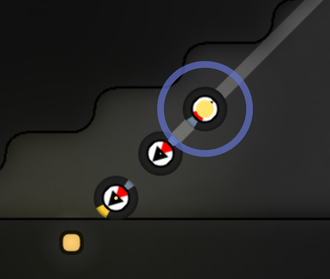

  
QQ群：565401831  
游戏介绍及入手请移步：[hoho大佬简书教程](https://www.jianshu.com/p/5431cb7f42d3)  
[系列目录](https://zhuanlan.zhihu.com/p/104412058)  
Version：1.0  
Author：Scorpior

# Screeps 运输模式（二）任务模式


## 引言
Screeps 中绝大多数物资运输都要依靠 creeps 完成，如何灵活地完成采矿、升级、factory、lab 
等的物资运输需求是一个极其有趣的设计难题。  

本文介绍一种有效**结合了高效（特化）与灵活**的实现方案。

### 预备知识
#### 同时动作 
Screeps 中你每 tick 可以调用 creep 执行一些动作，需要了解的是你的代码在调用 api 时只是告诉了服务器**你想做什么**，比如你想 
withdraw 一些资源，返回值为 *OK* 常量只意味着服务器成功记录了你想做 withdraw，下一
tick 你取的资源才会出现在 creep 身上。根据[官方docs](https://screeps-cn.github.io/simultaneous-actions.html)的介绍，有些动作是可以在同一 
tick 中同时执行的。其中移动类动作 move、moveTo、moveByPath 
是可以和任意的非移动类动作同时执行，也就意味着你可以在调用 withdraw 或 transfer 返回 OK 的同一 
tick 开始移动，而不用等待下一 tick 身上资源数量改变。

#### 角色驱动与任务驱动
hoho大佬已经[解释了缘由啦](https://www.jianshu.com/p/7226e08c4b8e)。

## 初步
在角色驱动的 creep 逻辑中，creep 需要每tick遍历查找各种建筑来判断需不需要工作，这里其实存在一种 cpu
浪费。以用 link 将 source 处采集的能量传回 storage 存放为例，平时大多数 tick 中矿点的 link 都是在默默等待矿机（挖矿的 
creep）将能量放进去，这个时候等在 storage 附近的运输型就没必要每 tick 去判断 storage 旁边的 link 
需不需要搬出能量。在矿点 link 装满后，你的程序有一个地方会使用```link.transferEnergy()```函数将能量传回
storage 旁边的 link，那么能不能此时在这个逻辑中顺便通知运输型 creep 该开始工作了呢？通过任务机制，我们可以实现这样的**信息传递**。

link 要通知 creep 的话，肯定要传递一些数据或者调用一些函数，如果在 link 代码中调用 creep 
的函数会让程序逻辑非常复杂，而且多个建筑同时工作时容易互相干扰，因此选择传递一些数据是更加明晰的做法。我们把传递的数据称为**任务**，link
创建这些数据的动作称为**发布**任务。直观地，我们可以在任务中记录这些数据：
```js 
let link的任务 = {
    从: storage旁边的link,
    把: RESOURCE_ENERGY,
    搬到: storage
};
```
然后我们需要一个缓存池来存放这些任务，简单起见就用 JS 里的数组（我习惯用[全局缓存](https://github.com/lc150303/The-design-of-OverDom/blob/master/advanced%20guide/存储机制.md#邪教)，你也可以用 [Memory](https://github.com/lc150303/The-design-of-OverDom/blob/master/advanced%20guide/存储机制.md#正道)）：
```js 
// 在初始化代码中
global.某个房间的任务缓存池 = [];  // 新建一个数组

// 在工作代码中
某个房间的任务缓存池.push(link的任务);   // 把上面那个任务放进缓冲池
```
如果所有的运输工作都以任务方式进行，那么我们的运输型 creep 要做的就是每 tick 监控```某个房间的任务缓存池.length```，通过这一个变量就可以知道有没有任何一个建筑需要搬运物资，比遍历不同种类的建筑省很多语句。
```js 
var 正在执行的任务 = undefined;    // 用了局部缓存，需要注意避免多个 creep 互相冲突

function work(creep) = {
    if (!正在执行的任务) {      // 目前没有任务
        if (某个房间的任务缓存池.length) {    // 任务池里有任务
            正在执行的任务 = 某个房间的任务缓存池.shift();   // 取出一个任务，也可以把 shift 换成 pop
        }
    }
    if (正在执行的任务) {      // 目前有任务或者刚拿到任务
        /**
         * 用状态机代码去 
         * 正在执行的任务.从 
         * 把 
         * 正在执行的任务.把 
         * 运到 
         * 正在执行的任务.搬到
         */
    }
}
```
这样我们的 creep 在没有工作时非常省 cpu，在工作中因为任务已经指明了从哪搬到哪，也**不需要再有更多的遍历判断**。而不同建筑发布任务时只需要将对应的建筑和资源类型替换一下，**按相同格式发布在任务缓存池**就可以有
creep 执行对应的运输工作，**非常容易增加新的建筑和新的任务**。
## 完善
上面我们的 link 是在调用```link.transferEnergy()```这个函数时发布任务，逻辑写好就不会发布重复任务。然而假如在 controller 旁边的 link 缺能量了，我们需要从
storage 把能量搬到 storage 旁边的 link 然后发送过去，我们的逻辑就可能大概是这样：
```js 

```

在上面的例子中，一个建筑只发布一个任务，一个任务只被一个 creep 接到，因此可以很好地**让不同 creep 同时去执行不同的任务**。但是如果我们是执行从
storage 搬到 terminal 这样的可能大批量的任务，只有一个 creep 去搬可能较慢，我们想让多个 creep 同时去搬也很方便——一次性发布