  
QQ群：565401831  
游戏介绍及入手请移步：[hoho大佬简书教程](https://www.jianshu.com/p/5431cb7f42d3)  
[系列目录](https://zhuanlan.zhihu.com/p/104412058)  
Version：1.0  
Author：Scorpior

# Screeps 进攻策略分析

## 引言
Screeps 在我眼中是一个4X战略游戏，战斗是必不可少的环节，基于“进攻是最好的防守”原则，本篇将分析游戏中的进攻策略，并以此作为防御策略的基础。本篇将从战略视角分析我认为的 Screeps 中战争的三大要素，指出宏观上的战争目的与战争手段，而不过多涉及具体算法和代码。本篇会有许多新奇的游戏技巧。

“知可以战与不可以战者胜。”——《孙子兵法》

## 总则
目前 Screeps 中提供的能对敌方单位与敌方建筑造成伤害的方式有两类：核弹和带特点部件的 creep，这两类方法都会带来**能量**和**化合物**消耗。而 Screeps 中提供的防御手段主要也有两类：修墙和 rampart（下文简称 rap）的静态防御以及防御塔的动态防御，这两类方法都需要消耗**能量**。此外，powerCreep 的技能也可以作为辅助战斗手段，目前已知的技能会带来 **ops** 消耗。因此，充足的**能量**、**化合物**和 **ops** 是自己**发动进攻的必要前提**，同理也是敌人**有效组织防御的必要条件**。

**削减敌方战争资源**是我们的第一种也是最根本的一种取胜方式。

面对大佬或者堕落帝国（比如Muon）庞大的国土，榨干敌方全局资源的战争目的会因为路程过远和己方资源有限等原因无法实现。但反过来我们也可以利用**路程分隔**和**局部资源差异**，创造局部战力差异，对敌方房间进行**各个击破**，类似的思想在军事理论中并不少见。“故用兵之法，十则围之，五则攻之，倍则分之”——《孙子兵法》。

**创造局部非对称战争**是我们第二种取胜方式。敌方防御能力弱小导致己方随便出兵就能获得战斗力优势，也归入此类情况。

Screeps 中一切行为都需要计算力来执行，战争带来的临时额外 cpu 开销往往会使玩家开始**消耗 bucket**，当 bucket 耗尽则需要在削减资源采集量和削减战斗力之间做抉择，而削减资源采集量最终结果也是资源库存耗尽后削减战斗力。除了 cpu 以外，多数玩家面对战争还需要临时调整代码，这也是人脑计算力开销，每个人的精力都是有限的，在长期透支身体的“bucket”后也必然无法维持战斗力。

**榨干敌方计算力**是我们第三种取胜方式。

## 一. 全局资源战争
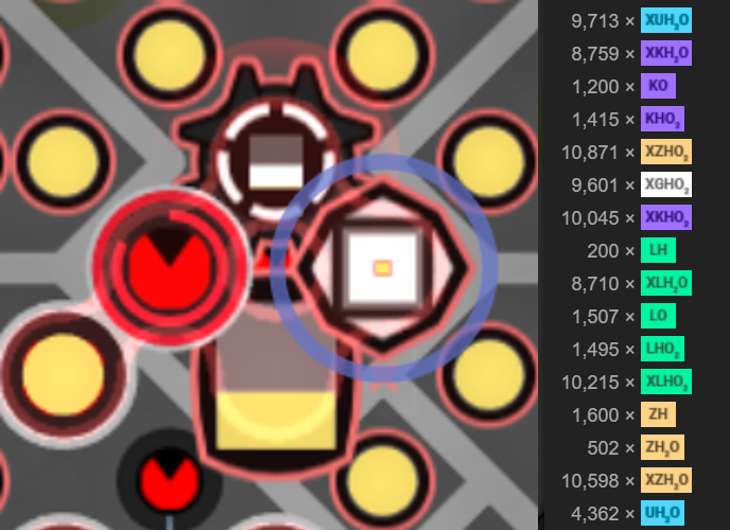

在 Screeps 中一般来说每个人的资源储量都足以让他生产不止一波战斗 creeps，并且除非已经把敌人家里拆干净了否则也拆不到 storage 等储存战争资源的建筑，因此基本不可能只通过一波兵力就达到耗尽敌方资源的效果。资源消耗战是一个需要精打细算**提升自己资源性价比、降低敌方资源性价比的**的持久过程。

### 磨墙
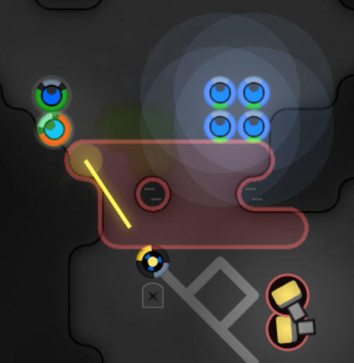

进攻没有墙的房间不需要战术~~（误）~~，能对墙（建筑物）造成伤害的 creep 部件有3种。WORK 每 tick 拆除 
50hits，折算成对方修墙的能量就是**0.5**，ATTACK 每 tick 伤害30折算能量**0.3**。RANGED_ATTACK 
单体攻击折算**0.1**，AOE攻击则以单层直线连续 rap 为例，贴身AOE伤害是 3×10+2×4+2×1 = 40 折算能量0.4，**高于 ATTACK**，间隙1格时AOE有 
5×4+2×1 = 22 的伤害仍**比自身单体攻击高**，间隙2格时AOE才弱于单体攻击。AOE不会对中立建筑造成伤害，因此**不会对 StructureWall 造成伤害**，如果有多层 
rap 则AOE的总伤害**会比 WORK 还高**。

三级化合物 boost 能使上述三种部件的工作效率提升至**基础值的4倍**，简单起见我们把防御方修墙能量与进攻方出兵能量视为成本，按最常见的 
10TOUGH+10MOVE+30有效部件 的配置来计算有下表（计入 boost 所需能量，奶妈以 10TOUGH+10MOVE+30HEAL 计）：

回本时间（tick）|WORK|ATTACK|贴身AOE|间隙1格AOE|RANGED单体
:-|:-:|:-:|:-:|:-:|:-:
自身回本|77|112|128|232|509
1:1带奶妈|229|364|317|576|1267

绝大多数情况下奶妈是必带的，那么拆墙时间小于 1267ticks 即路上准备时间大于 233ticks 的 RANGED_ATTACK 
攻击是亏本的，其他情况也同理考虑路程对交换比的影响。在实战中如果对方会出战斗 creep 
用于防御，那么我们通常**无法贴近墙边**（会被打死），此时**间隙1格的AOE**是对 rap 
**最高效**的攻击方式，在敌人的防御间隙还可以贴上去打出比 ATTACK 更高的AOE伤害。如果敌方是刷高 StructureWall 来防御的话，就只能靠 WORK 或者 ATTACK 冲锋了，StructureWall 对防御方 creep 的站位阻碍也构成一种平衡。

机智的防御方会捡取敌方 WORK 拆墙掉落的能量，改变能量交换比。

### 诱塔
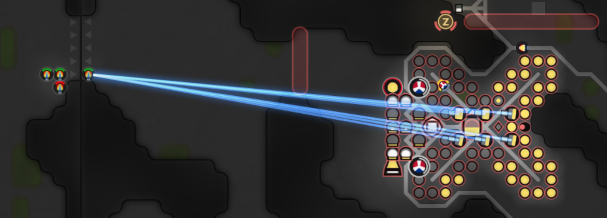

Tower 攻击房间中无论多远的目标都是每次消耗10能量，8级房6个塔同时开火的能量消耗是**双 source 房基础能量生产速度的3倍**，只要我们吸引敌方防御塔频繁开火那他很快就一滴都没有了！众所周知奶妈的 heal 
不需要额外能量，我们找个偏远的角落一直奶住不就好啦！

比较骚的做法是在房间入口吸引火力（如上图），利用游戏机制**自动跨房**跳动。这样一是奶妈在隔壁房，别人只能打你送进去的 creep 而没有选择，二是在敌方房间每次只呆 1tick，遇到变故也能马上脱离。

**Tower draining** 是比较常见的战术，有经验的玩家会不攻击这样具有明显欺骗性的 creep，不过~~道高一尺魔高一丈~~，下文中会介绍针对性的改进战术。

### 骚扰外矿
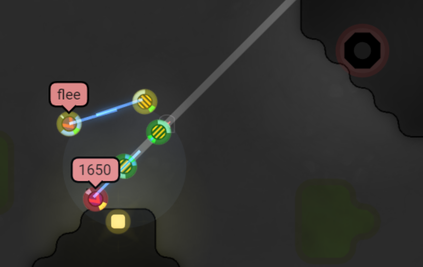

相邻房间作为外矿的能量收益基本与房内 source 相同，打击敌人外矿能极大限制敌方能量收入，骚扰外矿也是游戏中常见的战争行为。

除了削减敌方收入以外，骚扰敌人外矿还很可能吸引敌人出更多的平民 creep （矿工、运输工、reserver）和战斗 creep （守卫外矿），和引诱防御塔类似，这也是在增加敌人的能量支出。如果我们能通过比如**高效击杀敌方creep**、**破坏道路**等方式吸引敌方花费大量能量在修复和守卫外矿上，这个收入与支出的双重打击将重创敌方经济。

依赖于外矿能量收入的代码，比如 OverMind，只要封锁全部外矿就会被饿死。

### 破坏重建
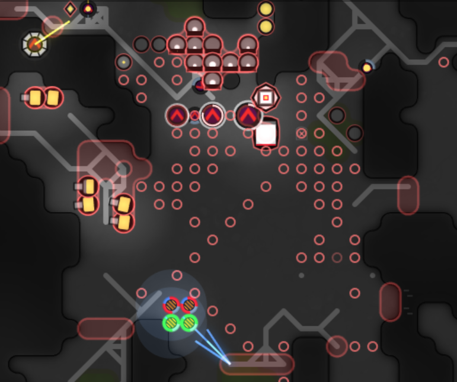

拆毁房间建筑后敌方的 controller 仍然需要很长时间才会掉级，这段时间内敌方可以依靠自己其他房间或者他友军房间进行重建，如果没有开启 safemode 的话重建的过程中敌方是比较脆弱的。每个高级建筑动不动就价值50k、100k能量，即使是便宜的 extension 数量多了成本也很可观，在没有 rap 的情况下我们进去逛一圈就能让敌人辛辛苦苦重建的成果付之一炬。

一般敌方会在房间中原地采集能量进行重建，拆毁重建的建筑物不会对敌方其他房间的战斗力造成显著影响，但是我们也可以像骚扰外矿一样通过**围城打援**的战术消灭敌方 
creep，从而间接削减敌人其他房间的能量。如果敌人不打算复建的话，**派带 CLAIM 部件的 creep 去 attackController** 
能大大加速敌方掉级，房间掉级后敌人再想重建就要在升级上额外花费大量能量。

### 垄断市场

在敌方 credit 充裕的情况下，即使我们采取各种精密的战术阻碍敌方采集资源，敌人也可以从市场上瞬间补齐所需，全局资源战争也就离不开钱钱钱的较量。联盟之间的战争往往会引发市场上战争资源价格**暴涨数倍**，财力更加雄厚的一方可以采取**挂天价 buy 单**同时**扫货**的方式垄断市场。

除了对战争资源进行抬价以外，在 SUN 与 YP 的联盟战争中，还出现了**抛售 Subscription Token**
进行压价的行为，阻碍敌人通过现实世界货币买 Token 换取 credit，我只能说一个字：壕！

## 二. 局部歼灭战争
消耗敌人全局资源虽然是理论上最彻底的胜利方式，但是在 Screeps 世界中生效速度比较慢，还会因为战斗 creep 一生只能走1500步的限制而无法对面积广阔的帝国奏效，我们需要一些局部打得爽的玩法~。~~爽就完事了~~

### 围城与 powerCreep
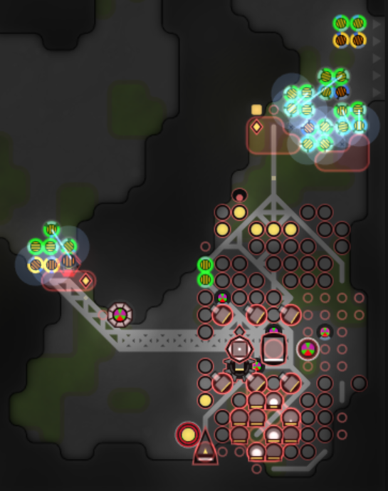

用数倍于敌方一个房间所能生产的兵力对这个房间进行围城，顿时史诗感就有了是不是~~（手动滑稽）~~。

对单一房间的重点进攻可以辅以**封锁所有相邻房间出口**的手段，阻止敌方跨房资源（然而绝大多数人没有跨房支援）。如果敌方房间内可以使用 powerCreep 的技能，则还可以通过**阻止 source 再生**、**封锁 terminal**、**封锁 spawn** 等手段进一步削弱房间的防御战斗力，~~主要是可以让你在 thewarpath 上更加耀眼~~。

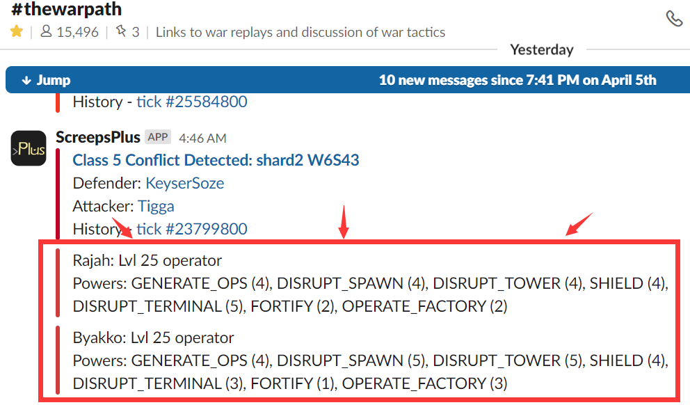

### 利用地形

Screeps 世界里目前有3种地形，房间出口可以算额外的一种，除了平原（plain）以外的地形都可以成为 creep 战斗的帮手或者陷阱。

#### a.追逐战
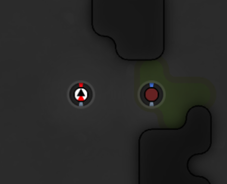

你的红球（只带 ATTACK 的 creep）有没有遇到被敌方蓝球（以 RANGED_ATTACK 为主的 
creep）风筝的情况呢？墙和沼泽可能可以帮助我们反败为胜。比较主动也比较难实现的方式是在墙壁或者沼泽形成死角的情况下，我们控制好相对位置将敌人的 creep **赶进死角**逮住，然后~~做一些不可描述的事情~~。但如果反过来如果沼泽形成了上图这样的通道，使得敌方主动进攻我们需要从右往左踏进沼泽的话，我们就可以在沼泽左边~~卖萌~~**守株待兔**，如果敌方前来攻击，我们就可以在他 fatigue 归零前贴身~~然后你懂的~~。

#### b.伏击战

房间出口是地图上最特殊的地形，每 tick 只有单排 creep 可以经过，也就会强制拆散敌方的多人小队，并且在 creep 
踏入新房间前常常**缺乏对应房间的视野**。如果我们在房间入口处集中兵力，比如三四个红球在坐标为1或者48的位置等着，非常容易在敌方
creep 进来的第一 tick 对其造成毁灭性打击。这样的跨房策略**比较需要 observer 的配合**，获取隔壁视野才能实现埋伏与发现埋伏。

### 传送门
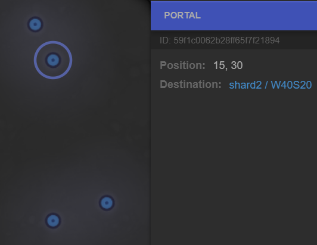

传送门（Portal）是 Screeps 世界中的空间奇点，creep 和 powerCreep 踏入以后会瞬间到达地图上另一个点，会**改变部队的作战半径**。当前官服的传送门有**4个特征**：
1. shard1 至 shard3 之间的垂直传送门永久存在于每个十字路口，并固定到达另一镜面的同名房间
1. 同 shard 内的传送门会在每个 sector 的中央房随机产生，产生大概一周的跨 sector 抄近路的机会
1. shard1 的许多十字路口会像上图这样具备多个稳定传送门，一个房间通向 shard0 的多个房间，形成不规则的捷径
1. shard0 的部分封闭区块外围有一圈传送门，形成跨单个 sector 的捷径

想利用好整个游戏世界内数量众多的传送门、计算出自己 creep 的实际行动范围，需要一份通用的跨传送门寻路算法，我认为这是 Screeps 这个游戏中的顶级科技之一。这个游戏的科技不在于建筑等级、兵种等级，而在于算法功能。在己方有能力跨传送门寻路而敌方不能时，我们就可以躲在传送门的**保护**之中出兵攻击，即使出师不利也不会被反击，进一步还可以形成敌人不知道他哪些房间在我们进攻范围内的**威慑**。在 UoP 与 AYCE 的两次战争中，SBense 都采取从 shard1 出兵到 shard3 的打法，让 UoP 众人只能固守防御。

## 三. 计算力战争
计算力是 Screeps 游戏中比较隐晦又至关重要的资源，通常很容易忽视它对战争的致命影响。虽然说计算力的差距主要依靠代码优化的日积月累，但仍然有一些~~歪门邪道~~技巧可以让我们在战场上建立自己的计算力优势。

### 榨干 bucket 

在日常的和平状态下，大多数人都会尽量使用 cpu 进行生产和升级，但也留下了一旦突发战争就很容易开始消耗 bucket 的隐患。Bucket 跌入低位后除了会强迫他在减少资源采集量和减少战争动作之间选择外，还会使他在 bucket 恢复前失去爆发计算力进行高级活动的能力。在主力进攻前先通过骚扰清空敌人 bucket，和在进攻的间隙保持骚扰使敌人无法恢复
bucket，是创造战斗力优势的辅助手段。

#### a.诱塔 

上面我们已经提到防御塔的动作非常消耗能量，除了能量以外，由于每个动作强制的 0.2cpu 消耗，6个防御塔同时行动也会给敌方带来**每次 1.2cpu 的开销**。单独消耗一个房间的防御塔可能不会对敌方整体照成什么影响，但如果我们以诱骗防御塔为目标同时骚扰敌方多个甚至全部房间，将带来非常显著的收益。这里额外针对实战中典型的防御塔工作模式介绍两个引诱战术。

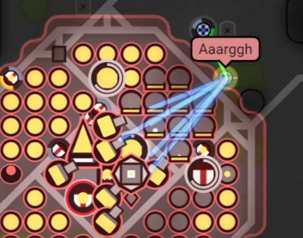

很多大佬的代码都会根据入侵 creep 的相对位置和身体部件，计算每个 creep 本 tick 能获得的最大治疗量，同时按照入侵 creep 和自己6个塔的距离计算总伤害值，**选择治疗量低于伤害值的 creep 进行攻击**。作为进攻方，我们不希望自己的 creep 
阵亡浪费造价，必然要配备足够的奶妈并**贴身跟随**，如果我们缺乏 HEAL 部件的 creep 与奶妈脱节就会遭到防御塔攻击......等等！如果我们故意脱节呢？选取一个地形空旷（没有 plain）且伤害合适的位置，让我们的诱饵 creep
**主动与奶妈脱节**然后下一 tick 回到奶妈身边，如果我们的奶量足够把伤害值奶回来就可以白白欺骗防御塔的能量和 cpu 了！

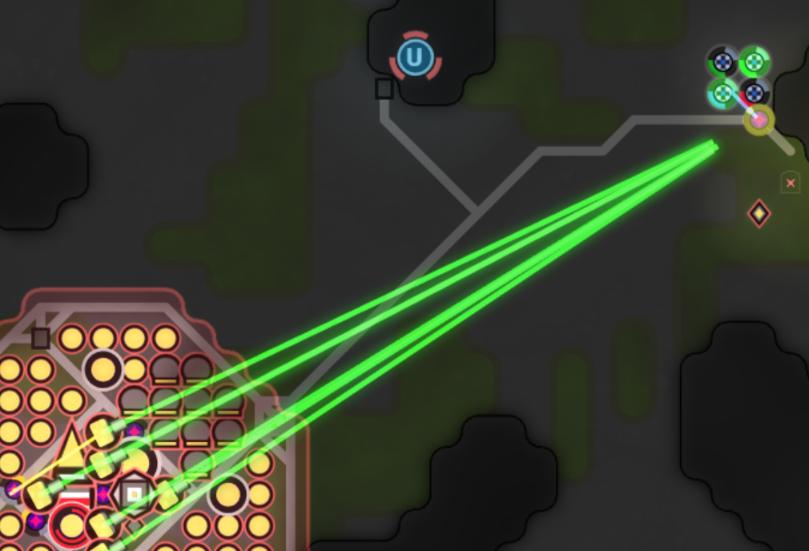

不少人有使用防御塔进行维修或者治疗的习惯，如果他**维修or治疗得很频繁**的话也不失为一个值得利用的弱点。我们可以把防守方 rap 以外的道路和 creep **打伤而不摧毁**，等他代码自动浪费能量和 cpu 修回去，就可以轻松收获高额的成本交换比。

容易发现防御塔和入侵者的博弈是一个非均衡的过程，上面两种诱饵 creep 的行为也可以再通过修改防御塔逻辑来识破，最终可能演化为愿意在这个博弈中投入多少精力改代码的问题。

#### b.游击战
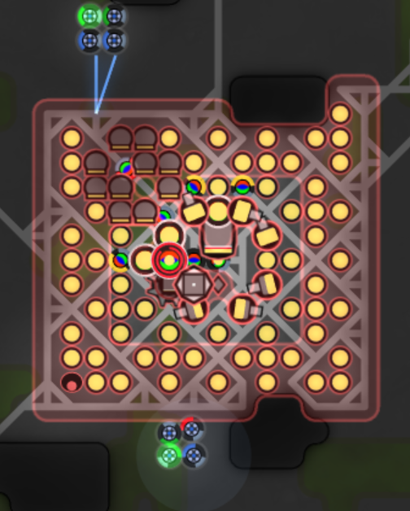

出红球进行主动防御是一种很高级的防御手段，但是很多人为了节约成本并不会生出足以驻守 rap 各个角落的红球，**少量红球跟着入侵者**跑是常见现象。对于这种数量较少的主动防御，进攻方可以采取多队部队从防御阵型**不同方向**进攻的方法，比如上图两个小队，上方的离 
rap 远一点，下方的贴在 rap 上攻击，等防御方红球跑下来以后换成上方小队贴 rap， 下方小队脱离1到2格，这样利用轮流踏入红球攻击范围（贴着 rap）的方式**欺骗红球来回跑**，而自己的 creep 只需要**偶尔挪动一两步**，创造有利的 **cpu 交换比**。

### 疲劳战术

实战中绝大多数玩家都需要临时根据战斗情况改代码，改代码显然是一种大量的**人脑计算力消耗**，并且摧毁对方单位的愉悦和对自己建筑被拆的担忧会让人一直保持兴奋状态，十天半个月之内~~身体必然被掏空~~。

在 UoP 与 AYCE 战争中大刺蛇 Christinayo 的单房全自动防御就吸引了 Atanner 和 SBense 持续改代码+手操打了好几天，直到 Atanner 表示生活中其他事情更重要、没精力打仗了~。总结经验我们可以通过两个要点吸引敌方~~掏空身体~~：
1. **维持一个有吸引力的战争目标**。大刺蛇单房防御，敌人没有其他房间可选，并且认为多次拆掉这个房间就能打败大刺蛇，构成持续吸引力。
1. **有意造成自己疲于应对或者代码不够智能的假象**。大刺蛇的防御算法有一定的随机因素，不太会攻击敌方脱节的
creep，让对方以为发动攻击时是手操的，于是对方也乐于手操进攻。除了让敌方误以为是手操以外，如果有意做出一些不完美的假象，比如自己的战斗小队移动中脱节等，也很可能让对方低估己方战斗力而**觉得他再投入一些精力写代码马上就能获胜**。

## 最后

说了这么多，其实就像星际中看韩宗各种眼花缭乱的战术而自己手速不够实现不了一样，Screeps 中的各种战术也常常因为写代码的能力或者精力不足而无法实现。玩游戏嘛，开心就好，借用 Kasami 一句话：你永远无法打败一个坚持不懈 respawn 的人。

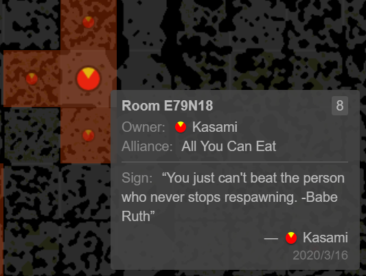